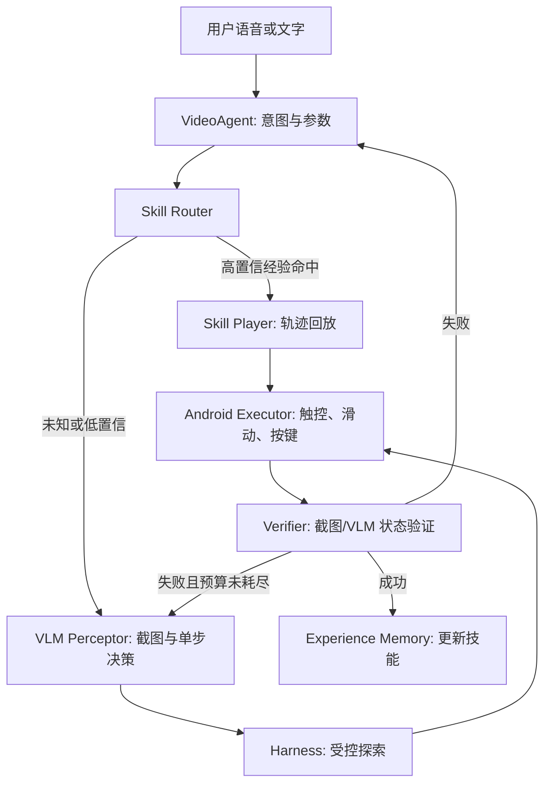

# GUIAgent：VLM 主导、带经验记忆的通用中屏触控操作方案

## 1. 目标与基本判断

目标是在华为 AZ102u-10 FTTR 中屏盒（Android 9）上，以自然语言操控爱奇艺、腾讯视频、夸克网盘等 App，并在遇到未见页面时完成受控探索；一次成功后将操作经验沉淀，后续同类页面优先直接复用。

本方案不再将 OCR 或 UI dump 作为主要页面理解手段。VLM 是主观测器与单步动作选择器：只要控件已经在屏幕可见，即使没有无障碍节点，系统也能根据截图定位目标、执行受控操作并做视觉验证。未唤出的播放器控件则根本不在截图和 UI 树中，必须先触发状态转换。因此核心闭环是：**观察 → 单步决策 → 受控执行 → 视觉验证 → 记忆更新**。

这里的"通用"是指对任意 App 的**可见界面**均可使用同一套视觉操作闭环，而不是保证能看见未渲染控件或绕过验证码、登录、支付等受保护流程。

## 2. 总体架构



### 2.1 职责边界

| 模块 | 负责什么 | 不负责什么 |
|---|---|---|
| VideoAgent | 解析用户目标、选择技能或探索、解释最终结果 | 推理具体像素坐标和无限重试 |
| VLM Perceptor | 理解可见截图、判别页面状态、输出单步动作建议与目标区域 | 定位隐藏/未渲染控件、直接执行操作 |
| Harness | 前置条件、动作白名单、超时、动作预算、恢复 | 自由语义规划 |
| Android Executor | 截图、点击、滑动、文本、DPAD/媒体键 | 判断操作是否达成 |
| Verifier | 以视觉状态检查后置条件 | 用"调用未报错"冒充成功 |
| Experience Memory | 匹配、回放、统计和失效经验 | 永久相信旧坐标 |

## 3. 控制策略：语义动作优先，VLM 通用操作为主

每个用户请求按下列优先级处理：

1. **系统语义动作**：播放、暂停、上一集、下一集、快进、后退、音量等，优先发媒体键或系统动作，不必打开控制条。
2. **高置信经验技能**：命中同 App、同页面状态和同意图参数的成功轨迹时，先检查前置条件，再回放。
3. **App 专属稳定技能**：例如 `tencent.set_speed`、`aiqiyi.select_episode`，使用已验证的唤出/进入面板路径。
4. **VLM 通用操作**：未知页面、可见自绘页面、App 变版或专属命令失败时，采用"截图→VLM单步动作→执行→验证"循环。
5. **安全退出**：探索预算耗尽或目标歧义时停止，并反馈当前页面与失败原因；不继续盲点。

**说明**：App 专属稳定技能（第 3 级）本身是从通用探索沉淀出的高频加速路径，已验证可靠且执行速度远快于 VLM（~0.2s vs 1-2s）。因此它作为 VLM 的"快车道"，优先级高于 VLM 通用操作。VLM 通用操作（第 4 级）只在专属命令不可用或失败时才启动，既降低成本又保留灵活性。

## 4. 视觉状态模型

VLM 不返回自由描述，而使用强约束 JSON。一次观察对应一个 `VisualStateSnapshot`：

```json
{
  "app": "com.tencent.qqlive",
  "page_type": "player",
  "screen_mode": "fullscreen",
  "control_bar_visible": true,
  "overlay": "speed_panel",
  "focused_region": {"bbox": [0.48, 0.27, 0.61, 0.35], "label": "1.5x"},
  "task_status": "in_progress",
  "targets": [
    {"label": "1.5x", "role": "speed_option", "bbox": [0.48, 0.27, 0.61, 0.35], "confidence": 0.92}
  ],
  "next_action": {
    "type": "tap",
    "target_label": "1.5x",
    "bbox_normalized": [0.48, 0.27, 0.61, 0.35]
  },
  "screen_signature": "tencent|player|bar_visible|speed_panel",
  "confidence": 0.89
}
```

### 4.1 页面状态类别

- `player`：播放器主界面；另带 `control_bar_visible`。
- `detail`：片源详情页。
- `search`：搜索输入或结果页。
- `list/grid`：选集、文件、推荐或海报列表。
- `dialog/overlay`：倍速、清晰度、确认框、登录框等。
- `unknown`：无法可靠判定，禁止直接执行高风险点击。

`screen_signature` 只采用稳定视觉结构、前台包名和页面状态；不以整张截图 hash 作为主键，避免视频画面、广告、封面变化造成误判。

### 4.2 VLM 单步动作协议与调用原则

VLM 只允许输出一个下一步动作，禁止输出自由文本或连续多步计划。`next_action.type` 仅允许 `tap`、`swipe`、`type_text`、`remote_key`、`media_key`、`wait`、`back`、`reveal_controls`、`done`、`ask_user`。`bbox_normalized` 使用 0～1 的归一化边界框；Executor 再按屏幕分辨率换算。

操作后，Verifier 只向 VLM 发送新截图与预期结果，并要求返回 `success`、`not_yet`、`failed`、`unknown` 四种之一。`unknown` 不能记为成功，最多进入一次受控重观察。

- **首次未知页面**：完整截图 + 用户子目标 + 已执行动作摘要，生成一个单步动作。
- **已知技能回放**：只在前置检查和后置验证调用；不逐步调用。
- **低置信定位**：先裁剪目标候选区域，再二次询问，避免全屏猜坐标。
- **输出限制**：坐标只接受归一化 bbox；模型自报的 confidence 只能作参考，不得单独作为点击依据。
- **部署**：RK3566 只执行截图与动作；VLM 部署在局域网 PC 或云端。设备侧负责压缩、页面签名缓存与超时控制。

## 5. 隐藏控件：Control Revealer

隐藏控件不是视觉定位问题，而是状态转换问题。对播放器类动作先调用 `reveal_controls()`：

```text
检查：当前是否为 player 且 control_bar_visible=false
→ 尝试 per-App 唤出序列
→ 每步等待动画并截图验证
→ 成功：返回可见控制条状态
→ 失败：切换下一策略；最多 3～4 步
```

建议策略表按 App、Activity 和横竖屏保存：

```json
{
  "app": "com.tencent.qqlive",
  "state": "player|bar_hidden",
  "actions": [
    {"op": "tap_normalized", "x": 0.50, "y": 0.50, "wait_ms": 700},
    {"op": "remote_key", "key": "DPAD_CENTER", "wait_ms": 700},
    {"op": "remote_key", "key": "MENU", "wait_ms": 900}
  ],
  "verify": {"predicate": "control_bar_visible"}
}
```

控件已出现但没有 dump 节点时，使用 VLM 的 bbox 点击或 DPAD 相对导航。控件未出现时，禁止让 VLM 猜"隐藏按钮的位置"。

## 6. Experience Memory：经验记忆与技能回放

### 6.1 两类记忆

**Tips（通用经验）**记录不依赖特定页面的规则，例如"播放器控制条不可见时先中心点击；确认支付、删除、发送等外部副作用动作必须征求确认"。

**Shortcuts（可执行技能）**记录某 App 某状态下，完成一个明确意图的完整成功轨迹。例如"腾讯视频播放器设置 1.5 倍速"。

### 6.2 技能数据结构

```json
{
  "skill_id": "tencent_player_set_speed_1_5_v1",
  "match_key": {
    "app": "com.tencent.qqlive",
    "page_signature": "tencent|player|bar_hidden",
    "intent": "set_speed",
    "params": {"speed": "1.5"}
  },
  "preconditions": [
    {"field": "page_type", "equals": "player"}
  ],
  "trajectory": [
    {"op": "tap_normalized", "x": 0.50, "y": 0.50},
    {"op": "wait", "ms": 700},
    {"op": "tap_normalized", "x": 0.80, "y": 0.88},
    {"op": "wait", "ms": 500},
    {"op": "tap_target", "target": "1.5x", "fallback": "dpad_search"}
  ],
  "verification": {"field": "current_speed", "equals": "1.5"},
  "stats": {
    "success_count": 3,
    "failure_count": 0,
    "confidence": 0.88,
    "last_verified_at": "2026-08-18T00:00:00Z"
  }
}
```

### 6.3 匹配与信任策略

技能命中必须同时满足：App 一致、页面类型一致、页面视觉签名相似、前置条件成立、参数可兼容。建议评分：

`score = 0.30*app + 0.25*page_signature + 0.20*intent + 0.15*success_rate + 0.10*recentness`

- `score ≥ 0.85`：直接回放，但仍验证。
- `0.65 ≤ score < 0.85`：回放到关键节点后重新 VLM 定位。
- `< 0.65`：视作未知页面，走探索。
- 同一技能连续两次验证失败：禁用并标记 `stale`，重新探索生成新版本，不能继续盲用。

### 6.4 从探索到写入记忆

一次探索成功后不能把原始 LLM 对话直接保存；需要由 `Skill Extractor` 归纳为可复用轨迹：去除偶然动作、坐标归一化、抽取前置条件与验证谓词、附加截图签名和置信度。初始置信度设为 `0.60`；连续成功后逐步上调。

## 7. Harness：受控探索与执行规则

Harness 是机械执行层，所有 VLM 建议的动作都必须经过它校验。一次点击必须同时满足：目标语义与用户子目标一致、bbox 位于屏幕内且尺寸合理、动作属于白名单、不在敏感区域、且存在可观察的后置验证条件。目标过小、靠近危险按钮或同名候选过多时，裁剪区域后二次观察或改用 DPAD 搜索。

### 7.1 可执行动作白名单

- `tap_normalized(x, y)`、`swipe(direction, distance)`、`long_press`；
- `remote_key(DPAD_*, ENTER, MENU, BACK)`；
- `media_key(PLAY_PAUSE, NEXT, PREVIOUS, FAST_FORWARD, REWIND)`；
- `set_text`、`go_back`、`go_home`、`launch_app`、`wait`。

禁止 VLM 下发任意 shell、安装/卸载、修改系统设置或无限循环。

### 7.2 执行预算

- 单次未知页面探索：最多 6 个原子动作、2 次 VLM 重新观察、1 次返回恢复。
- 单个高层命令：20 秒超时。
- 点击前：`bbox confidence ≥ 0.75`，且目标不位于敏感危险区域。
- 点击后：最多 2 秒内进行后置验证。
- 失败恢复：重观察 → 重新唤出 → 更换一个策略；仍失败则上报 Agent。

## 8. 验证机制

每个技能必须定义可观察的成功条件，不以"接口返回 ok"判定成功：

| 用户操作 | 验证谓词 |
|---|---|
| 播放/暂停 | VLM 识别播放/暂停图标或进度变化 |
| 调倍速 | `current_speed == target_speed` 或目标倍率选中态 |
| 选集 | 标题/集数变化，或播放进度重置 |
| 打开控制条 | `control_bar_visible == true` |
| 搜索 | 结果页出现且包含目标关键词 |
| 文件播放 | 文件名/播放器标题与目标一致 |

验证结果也写入记忆：成功提升可信度；失败记录失败动作、前后截图签名和原因（目标缺失、页面跳转、覆盖层异常、超时）。

## 9. 推荐代码结构

```text
commands/
├── executor/                    # 保留现有 WS + Accessibility 执行能力
├── observation/
│   ├── vlm/                     # 新增：VLM Client + Prompt + Schema
│   │   ├── client.py
│   │   ├── schemas.py
│   │   ├── prompts.py
│   │   ── screenshot.py
│   ├── harness/                 # 新增：Action Guard + 执行循环
│   │   ├── action_guard.py
│   │   ├── action_loop.py
│   │   ── control_revealer.py
│   ├── memory/                  # Phase 2 新增：经验记忆
│   │   ├── models.py
│   │   ├── repository.py
│   │   ├── matcher.py
│   │   └── skill_extractor.py
│   ├── screenshot.py
│   ├── vlm_client.py
│   ├── schema.py                # VisualStateSnapshot
│   └── state_resolver.py
├── harness/
│   ├── action_guard.py
│   ├── control_revealer.py
│   ├── skill_player.py
│   ├── recovery.py
│   └── verifier.py
├── memory/
│   ├── repository.py
│   ├── matcher.py
│   ├── skill_extractor.py
│   ├── models.py                # Tips, Shortcut, statistics
│   └── skills.jsonl             # 初期本地持久化；后续可 SQLite
└── apps/
    ├── aiqiyi/
    ├── tencent/
    └── quark/
```

现有 `dump` 与 OCR 完全不参与主决策链。它们可作为可选旁路信号，例如偶尔用于焦点或文本验证；即使二者始终为空，VLM 主链路也必须正常工作。

## 10. 分阶段落地计划

### Phase 1：通用 VLM 闭环（优先）

只实现最小主链路：`screenshot() → vlm_observe() → action_guard() → execute() → vlm_verify()`。先覆盖播放/暂停、控制条唤出、倍速、下一集、搜索并打开内容。此阶段不接入长期记忆，也不依赖 dump/OCR。

验收：未知但可见的页面能完成"单图观察—单步操作—视觉验证"；VLM 输出无效或目标歧义时绝不执行点击。

### Phase 2：隐藏控件 Harness

实现 `ControlRevealer`、per-App 唤出策略表、媒体键优先级和失败恢复。将 `set_speed`、`set_quality`、`select_episode` 改为"前置检查—唤出—执行—验证"。

验收：控制条初始隐藏时，核心播放器操作不依赖 dump 仍可完成；失败能返回可解释原因。

### Phase 3：经验技能记忆

实现 `Shortcut` 数据模型、技能匹配、成功轨迹提炼、置信度与失效规则。先让人工确认第一次探索后是否保存；稳定后再自动保存。

验收：同一 App、同类页面的第二次操作，VLM 调用次数显著下降，且成功率不低于首次探索。

### Phase 4：评测与优化

建立测试集：每个 App 至少覆盖播放页控制条显隐、详情、选集、搜索、弹窗、UI 改版/广告干扰。记录任务成功率、平均步骤数、端到端时延、VLM 调用次数、记忆命中率、错误点击率和技能失效率。

## 11. 关键风险与约束

- VLM 会误判小图标或坐标；必须用 JSON schema、语义/区域/动作白名单联合校验和后置验证限制它，不能只信任模型自报置信度。
- 页面视觉相似不代表操作语义一致；技能匹配至少需要 App、页面状态和意图三重约束。
- UI 更新会导致旧技能过期；连续失败自动失效而非反复重试。
- 付款、发送消息、删除、退出登录、订阅等不可逆动作必须经过用户确认，禁止通过历史技能自动完成。
- VLM 部署在 PC/云端时，截图与视频内容会离开设备；应明确用户授权、缩放/裁剪必要区域，并设置传输与日志保留策略。

## 12. 项目表述

可将项目核心能力概括为：

> 设计面向中屏视频 App 的 VLM 主导 GUI 操作框架：以截图视觉理解提供统一的页面观察与单步动作选择能力，摆脱对无障碍树完整性的依赖；通过 Harness 对动作白名单、隐藏控件唤出、视觉验证与失败恢复进行约束，并将首次探索成功轨迹沉淀为带前置条件与自动失效机制的可复用技能，实现未知页面的通用探索与已知页面的低成本稳定回放。
