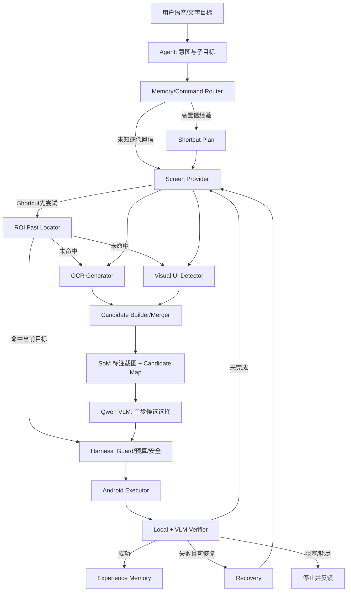

# GUIAgent：无 Dump 双通路视觉感知、Harness 与经验记忆完整方案

## 1. 项目定位

本项目面向 Android 9 中屏视频设备，通过自然语言操作爱奇艺、腾讯视频、夸克网盘等第三方 App。目标场景普遍存在自绘界面、播放器控制条隐藏、Accessibility 节点缺失、文字与真实按钮区域不重合等问题，因此最终方案不使用 UI dump。

系统采用四个互补层次：

1. **OCR文字感知**：寻找文字语义锚点；
2. **Visual UI Detector视觉感知**：寻找图标、按钮、卡片、进度条等交互区域；
3. **VLM语义决策**：根据用户目标和带编号截图，从候选中选择下一步；
4. **Harness确定性控制**：校验、执行、验证、恢复并管理经验。

核心闭环为：

```text
观察 → 候选生成 → VLM单步选择 → Harness执行 → 结果验证 → 经验更新
```

这里的“通用”指：对已经渲染在屏幕上的文字、图标和视觉控件使用统一闭环，而不是保证看见尚未显示的控件、绕过登录/验证码或自动执行高风险操作。

## 2. 核心设计判断

### 2.1 为什么不使用 dump

视频 App 的大量界面采用 Surface、自绘控件、WebView 或定制播放器，Accessibility 树可能为空、不完整或不给出隐藏控件。继续围绕 dump 做融合会让系统最关键的通用能力依赖最不稳定的数据源。

最终架构中，页面状态、候选生成、点击、验证和记忆均不需要 dump。包名和 Activity 可以通过已有 `ping`/前台状态能力获取，但不读取 UI tree。

### 2.2 为什么不能只用 VLM 坐标

VLM能够正确理解“哪个是倍速按钮”，但在大分辨率截图、小图标、密集列表和模型内部缩放情况下，坐标会出现偏移。全图自由 bbox 适合兜底，不适合作为所有点击的默认协议。

### 2.3 为什么 OCR 和图标检测都要

OCR对“1.5倍”“清晰度”“第3集”等文字目标精确，但不理解完整按钮边界，也无法处理纯图标。视觉检测器能提出图标、卡片和按钮框，却未必理解其功能。因此两条通路并行，VLM负责统一语义选择。

## 3. 总体架构



## 4. 双通路候选生成

### 4.1 OCR文字通路

OCR输出文字、文本框和置信度：

```json
{
  "candidate_id": "T4",
  "source": "ocr",
  "kind": "text",
  "text": "1.5倍",
  "bbox_px": [703, 532, 780, 568],
  "confidence": 0.96,
  "clickable_likelihood": 0.50
}
```

OCR框是文字锚点，不自动等于真实按钮区域。处理规则：

- 如果视觉检测器找到包含它的 menu/button/card，合并为完整交互候选；
- 如果只有 OCR 框，则在文字周边裁剪 ROI，让 VLM判断完整按钮或整行区域；
- 如果文字本身确实可点，局部 VLM可以返回文字区域；
- 多个同名文本同时存在时，结合页面区域、相邻候选和任务上下文选择。

### 4.2 视觉图标通路

Visual UI Detector输出视觉交互区域：

```json
{
  "candidate_id": "V7",
  "source": "visual",
  "kind": "icon",
  "text": null,
  "bbox_px": [590, 650, 670, 730],
  "confidence": 0.88,
  "clickable_likelihood": 0.86
}
```

检测器只需回答“这里像一个交互元素”，不要求准确命名图标。VLM根据形状、位置和上下文判断它是播放、暂停、全屏、返回或设置。

视觉检测器部署在 PC/服务器 sidecar，设备只负责截图和动作。第一候选明确采用 Microsoft OmniParser `icon_detect_v3` 的 interactive-region detector；初版不加载 icon caption 模型，图标语义仍交给 Qwen VLM。它必须先通过 Phase B0 的真实中屏准入实验，之后才成为默认 provider。内部通过 `UiDetector` 接口隔离具体模型，后续替换不影响 Harness；强依赖的是 `CandidateBuilder` 契约，不是 OmniParser 或任何单个 sidecar 进程。

### 4.3 候选融合

候选合并规则：

- OCR中心位于视觉按钮内：合并为 `ocr+visual`；
- 高 IoU 同类框：去重；
- 小图标嵌套在大卡片中：二者保留，因为操作语义不同；
- OCR-only：保留为低点击置信度文字锚点；
- 视觉-only：保留为纯图标/卡片候选；
- 候选过多：优先保留与任务文本相关、高交互概率和高检测置信度元素。

统一结果：

```json
{
  "screen_version": "...",
  "candidates": [
    {
      "candidate_id": "M2",
      "source": "ocr+visual",
      "kind": "menu_item",
      "text": "1.5倍",
      "bbox_px": [650, 510, 860, 590]
    },
    {
      "candidate_id": "V7",
      "source": "visual",
      "kind": "icon",
      "bbox_px": [590, 650, 670, 730]
    }
  ]
}
```

### 4.4 Provider故障隔离与显式降级

OCR和 Visual UI Detector 都实现为可失效的 `CandidateProvider`。`CandidateBuilder` 并行调用二者，每路具有独立 deadline、异常边界和熔断器；它在 provider 为空、超时、失败、熔断或禁用时仍返回当前截图对应的 `CandidateMap`，并记录：

```json
{
  "ocr_status": "ok",
  "detector_status": "timeout",
  "degradation_mode": "ocr_only",
  "provider_latency_ms": {"ocr": 183, "detector": 901}
}
```

降级状态机必须写成实现和自动化测试，而不是只存在于概念描述中：

| OCR | Detector | 处理方式 |
|---|---|---|
| 可用 | 可用 | 合并双路候选 |
| 可用 | 不可用 | 有文字目标则 OCR anchor refinement；纯图标/无匹配文字则直接 coarse-to-fine VLM |
| 不可用 | 可用 | 视觉候选 + VLM选择 |
| 两路均不可用或均无目标 | — | no-candidate fallback；低置信安全停止 |

默认 detector 在线 deadline 为 900ms，并随命令剩余预算收紧；连续3次超时/失败后熔断30秒，之后 half-open 只发一个探测请求。`empty` 与 `failed` 必须区分。sidecar应暴露 health/warmup 状态，但 health check不能替代单请求超时。禁止在 provider异常时复用上一个页面的候选。

## 5. SoM 与 VLM 单步决策

系统在候选框附近绘制 `T1/V2/M3` 编号，将开放式坐标预测转换为候选选择。VLM接收：

- 带编号截图；
- 精简候选列表；
- 当前子目标和可观察成功条件；
- 最近动作摘要；
- 检索到的少量经验提示；
- 允许动作集合。

正常输出：

```json
{
  "page_type": "player",
  "control_bar_visible": true,
  "overlay": "speed_panel",
  "task_status": "in_progress",
  "next_action": {
    "type": "tap_candidate",
    "candidate_id": "M2",
    "target_label": "1.5倍",
    "confidence": 0.93
  },
  "target_evidence": "M2是倍速面板中的1.5倍选项",
  "confidence": 0.93
}
```

VLM每次只选择一个原子动作。候选存在时不得重新报坐标。

## 6. 无候选与低置信兜底

### 6.1 OCR anchor refinement

文字已经识别、但完整点击区域未知时：

```text
OCR文字框
→ 按控件密度扩展周边 ROI
→ VLM在局部图定位对应整行/按钮
→ 确定性映射回原图
→ Harness低风险点击并强验证
```

### 6.2 No-candidate fallback

OCR和视觉检测都没有目标时：

```text
全图 VLM只给粗区域
→ 裁剪 ROI
→ 局部 VLM输出 bbox
→ 坐标映射、合法性校验
→ tap_visual
→ 强制验证
```

不得直接使用一次全图 VLM bbox；不得推测千问内部的 resize/padding。所有执行坐标统一为原始截图像素。

## 7. 隐藏播放器控件

隐藏控件没有渲染，OCR、视觉检测器和 VLM都无法定位。这是状态转换问题：

```text
识别 player + control_bar_visible=false
→ reveal_controls
→ DPAD_CENTER / MENU / 安全中心点击
→ 每步后截图
→ 候选、OCR或VLM确认控制条已出现
→ 再执行目标定位
```

不允许根据历史位置直接点击尚未显示的倍速、清晰度或选集按钮。

Reveal策略本身也属于会过期的经验，不能永久写死。每条策略记录 app/activity/orientation、动作序列、平滑成功率、连续失败次数、平均延迟、最近验证时间和 `active/probation/stale` 状态。只有“动作执行正常但控制条未出现”才算语义失败；设备断开、截图失败或模型超时不污染策略统计。

- 连续2次语义失败：进入 `probation`，降低排序；
- 连续3次失败或最近窗口成功率低于阈值：标记 `stale`；
- stale后回退通用 reveal序列；
- 新序列验证成功后新增版本，不覆盖历史统计；
- 选择策略时同时考虑成功率和延迟，避免长期优先选择虽然可用但很慢的路径。

## 8. 动态视频页面状态

视频画面每帧都在变化，因此完整截图 hash 不能作为页面版本。`screen_signature` 必须由程序根据结构化状态确定性生成，不能让 VLM自由生成字符串。VLM只输出受 schema约束的 `page_type/control_bar_visible/overlay` 等字段，`FingerprintBuilder` 负责归一化、排序、canonical JSON序列化和哈希。

```text
ScreenIdentity = {
  signature_schema_version,
  package,
  activity,
  page_type,
  control_bar_visible,
  overlay,
  stable_ocr_tokens,
  quantized_candidate_layout
}

debug_key = v1|package|activity|page_type|bar_state|overlay
layout_hash = SHA256(canonical_json(ScreenIdentity稳定字段))[:16]
screen_signature = debug_key|layout_hash
screen_version = screen_signature|本次观察nonce
```

`signature_schema_version` 用于以后升级生成规则。同一组结构化输入必须得到字节级一致的 signature；稳定 OCR token和候选布局先清洗、位置量化并排序。技能匹配比较结构化子字段，不对 signature字符串计算编辑距离。

稳定 UI 指纹使用：

```text
package + activity + page_type
+ 稳定 OCR token及量化位置
+ 候选类型及量化布局
+ overlay/control_bar状态
```

`stable_ocr_tokens` 与 OCR 的全量结果是两个不同的数据集。新增 `DynamicRegionMasker`，并把排除规则统一用于页面稳定性、signature生成和Shortcut stale检查：

- player 页面排除视频内容 ROI；只考虑顶部栏、底部控制条、菜单、弹窗等交互 UI；
- 即使 OCR 识别成功，字幕、弹幕、滚动通知、系统时钟、播放时间、进度百分比等动态 token 也不进入 signature；
- 位于稳定候选/交互区域内的 token 可直接保留；其他 token 只有在相隔约 250ms 的两个观察帧中“规范文本 + 量化位置”一致才保留；
- 两帧判断优先复用 action loop 已有的前后截图。普通动作不为此固定多截一帧；只在记忆写入或 stale检查不确定时主动补采样；
- 若视频区域边界不确定，采用保守排除，避免动态文字污染布局哈希。

执行前 stale 检查包括：

- package/activity没有发生不兼容变化；
- 目标候选仍存在于相近区域；
- 目标局部 patch 相似；
- 控制条或弹窗仍然可见；
- CandidateMap没有超过 TTL。

播放器稳定性检测忽略视频主体及其 OCR token，重点比较控制条、顶部栏、弹窗、稳定 OCR token和候选布局。仅字幕/弹幕/播放时间变化必须得到相同 signature；控制条显隐、菜单或弹窗变化必须得到不同 signature。

## 9. Harness

Harness是模型与真实设备之间的确定性安全边界。

### 9.1 动作协议

允许：

- `tap_candidate`；
- `tap_visual`，仅用于兜底；
- `swipe`、`type_text`；
- `remote_key`、`media_key`；
- `wait`、`back`、`reveal_controls`；
- `done`、`ask_user`。

禁止 VLM下发 shell、安装/卸载、清除数据、系统配置修改或无限循环。

### 9.2 Guard

点击前检查：

- candidate ID属于当前 CandidateMap；
- bbox合法且位于屏幕内；
- 页面版本仍兼容；
- 候选置信度和点击概率达标；
- OCR-only是否需要 refinement；
- 目标语义与用户任务一致；
- 是否属于登录、验证码、付款、订阅、发送、删除、退出登录、授权等敏感操作；
- 是否已经在相同状态下失败。

不再把底部区域统一视为危险区域，因为播放器合法控件集中在底部。

### 9.3 执行预算

建议默认：

- 最大原子动作 8；
- 普通子目标最大 VLM调用 4，发生一次受控恢复时硬上限 6；
- 最大恢复 2；
- 同一候选失败后不得在相同 UI fingerprint下重复点击；
- 达到预算立即停止并返回可解释原因。

20秒只是硬超时，还需要分解性能目标：

| 阶段 | p50目标 | p95上限 |
|---|---:|---:|
| 截图 | 200ms | 500ms |
| OCR与视觉检测并行 | 400ms | 900ms |
| 单次VLM决策 | 1.5s | 3.0s |
| 动作与动画等待 | 500ms | 1.2s |
| 本地验证 | 250ms | 600ms |
| 必要时VLM验证 | 1.5s | 3.0s |

简单点击目标 p95不超过5秒；包含一次 reveal的倍速/清晰度子目标 p95不超过12秒；恢复路径在20秒前停止。OCR和视觉检测并行，同一截图不重复处理，reveal优先用本地候选变化验证，本地验证明确时跳过VLM Verify。每次外部调用都接收剩余时间预算，不能各自使用完整20秒超时。

## 10. 验证与恢复

### 10.1 分层验证

优先使用本地快速信号：

- package/activity变化；
- OCR目标出现、消失或文字变化；
- 候选布局变化；
- 目标局部区域变化；
- 控制条、弹窗或菜单出现；
- 目标选项出现选中态。

本地规则无法确定时调用 VLM Verifier，输出：

```json
{
  "verification": "success | not_yet | failed | unknown",
  "reason": "...",
  "observed_state": {}
}
```

`unknown`不能当成功，只允许有限重观察。

### 10.2 恢复顺序

```text
重新截图与候选生成
→ 检查控制条/弹窗是否消失
→ 必要时 reveal
→ 排除刚失败候选
→ 选择第二候选
→ 局部 Grounding
→ 仍失败则停止或询问用户
```

## 11. Experience Memory

### 11.1 记忆层级

**Tips**保存可泛化规则，例如：

- 播放器控制条不可见时先 reveal；
- OCR文字框不一定是完整按钮；
- 动态播放器不能用整图 hash 判断页面稳定；
- 敏感操作必须请求用户确认。

**Shortcuts**保存某 App、页面状态和意图下，经过验证的参数化可执行轨迹，例如一个“设置倍速”Shortcut覆盖所有受支持倍率，而不是每个倍率复制一条技能。

### 11.2 Shortcut 数据结构

```json
{
  "skill_id": "tencent_player_set_speed_v2",
  "match_key": {
    "app": "com.tencent.qqlive",
    "activity": "PlayerActivity",
    "page_type": "player",
    "intent": "set_speed"
  },
  "parameter_schema": {
    "speed": {
      "type": "enum",
      "values": ["0.75", "1.0", "1.25", "1.5", "2.0"],
      "required": true
    }
  },
  "preconditions": {
    "control_bar_visible": true,
    "overlay": "speed_panel",
    "ui_fingerprint_pattern": "..."
  },
  "trajectory_template": [
    {"type": "reveal_controls"},
    {
      "type": "tap_target",
      "role": "speed_entry",
      "region_hint": [0.55, 0.70, 1.0, 1.0]
    },
    {
      "type": "tap_target",
      "kind": "menu_item",
      "text_template": "{speed}倍",
      "region_hint": [0.45, 0.40, 0.90, 0.90]
    }
  ],
  "locator_plan": [
    "roi_text_or_patch",
    "roi_visual_detector",
    "full_candidate_builder",
    "vlm_fallback"
  ],
  "verification_template": {
    "ocr_contains_template": "{speed}倍",
    "selected_state": true
  },
  "stats": {
    "success_count": 4,
    "failure_count": 0,
    "confidence": 0.88,
    "state": "active",
    "last_verified_at": "2026-08-19T00:00:00Z"
  }
}
```

Skill Extractor必须执行参数泛化：识别轨迹中随用户参数变化的文字/值，将其提升为 `parameter_schema` 和模板变量。运行时先做类型、枚举或范围校验，再渲染 `text_template`。如果当前页面没有合法参数候选，则退出Shortcut并走通用探索，不能点击最近似值。

轨迹必须语义优先。能表达成 `tap_target(role/text_template)` 的步骤不能固化成 `tap_normalized`。坐标仅作为 `region_hint` 或经过局部视觉指纹验证的低优先级 fallback；中心点击唤出控制条也应保存为命名原语 `reveal_controls/reveal_safe_center`，而不是裸坐标。

Shortcut保存目标语义、相对区域、局部视觉指纹和分级 `locator_plan`。每次回放必须在当前截图上重新定位/验证目标，但这不等于固定运行一次全屏 OCR + detector：

```text
当前截图 + region_hint
→ ROI OCR（文字）或局部 patch/template（图标）
→ 不确定时仅对 ROI 调 visual detector
→ ROI 未命中时运行全屏 CandidateBuilder
→ 仍未命中时才调用 VLM fallback
```

ROI定位结果也要转成绑定当前 `screen_version` 的临时候选，由 ActionGuard校验后执行；不得直接点击历史坐标，也不得复用旧 CandidateMap。这样 Shortcut 保存的是“如何在当前画面快速重定位”，而不是陈旧坐标。它通常节省全屏 detector 与 VLM规划，但不是承诺零模型成本。

### 11.3 匹配与信任

匹配不能依靠一个自由生成的 signature字符串，也不能把下面的数字永久焊死。各分量必须有明确的0～1定义：

- app/package：规范化后精确匹配；
- activity：精确匹配或显式别名映射；
- page state：`page_type/control_bar_visible/overlay` 字段级匹配；
- intent：归一化 intent ID精确匹配；
- params：按 `parameter_schema` 判断兼容性，不要求与历史示例值相等；
- OCR/layout：`stable_ocr_tokens` Jaccard和候选类型/量化位置匹配；
- reliability：带先验的平滑成功率，避免一次成功即满分；
- recentness：按配置的半衰期衰减。

可以用下式作为初始假设，但权重和阈值必须放在版本化配置中：

```text
score_v0 =
0.25 * app/activity
+ 0.20 * page_type/overlay
+ 0.20 * intent/parameter_compatibility
+ 0.15 * OCR/layout similarity
+ 0.10 * local visual similarity
+ 0.10 * success/recency
```

- `score >= 0.85`：使用 Shortcut，但仍检查前置条件和最终验证；
- `0.65 <= score < 0.85`：只用作候选区域提示，关键节点重新让 VLM选择；
- `< 0.65`：按未知页面处理；
- 连续两次验证失败：标记 `stale`，停止回放并重新探索。

这些阈值也是初始值。Phase F使用独立验证任务集调参，输出错误回放率、匹配 precision、coverage 和节省的VLM调用数。目标优先压低错误回放，而不是最大化命中率；最终权重、阈值、配置版本和评测结果一起保存。

### 11.4 经验写入

只有完整任务被 Verifier 判定成功后才能写入：

1. 清理 wait、误点和恢复等偶然动作；
2. 将 candidate ID转换为语义锚点，并把可变参数提取为模板变量；
3. 坐标归一化并保存局部视觉指纹；
4. 抽取前置条件和后置验证；
5. 初始置信度设为 0.60；
6. 检测并拒绝“同一意图仅参数值不同”的重复技能；
7. 多次跨会话、跨参数成功后升级为高置信 Shortcut。

登录、验证码、付款、订阅、发送、删除、授权、密码等任务不得自动沉淀为可直接回放技能。

## 12. 控制策略优先级

1. 系统媒体键和确定性系统动作；
2. 高置信 Shortcut；
3. 已迁移的 App 专属稳定技能；
4. OCR+Visual双通路候选 + VLM选择；
5. OCR anchor局部定位；
6. 全图粗定位 + 局部 VLM兜底；
7. 安全停止或询问用户。

专属技能与记忆是通用探索成功后的加速路径，不得绕过 Harness 和验证。

## 13. 工程落地阶段

### Phase A：无 Dump 观察层

- 统一 ScreenshotProvider；
- RapidOCR单例；
- CandidateMap、缓存和 UI fingerprint；
- 移除通用状态链路中的 dump。

### Phase B0：Visual Detector准入实验

- 收集并标注 100～200 张真实中屏截图，覆盖爱奇艺、腾讯视频、夸克、player/detail/list/grid/dialog、控制条显隐、纯图标、小图标、广告和主题变化；
- 以 OmniParser `icon_detect_v3` 为第一基线，pin代码 commit和权重 revision，记录许可证、部署硬件和复现命令；
- 统计总体目标召回、纯图标召回、候选数分布、p50/p95延迟、显存/内存和安装复杂度；小目标以中心落入 GT 或 `IoU >= 0.3` 判定命中；
- 初始 go/no-go 线：总体目标召回 `>= 0.90`、纯图标召回 `>= 0.85`、部署机 p95 `<= 900ms`、候选数 p95 `<= 40`；阈值与结果版本化；
- 不达标时先调阈值/输入尺寸，再比较第二 detector 或保留 Qwen coarse-to-fine fallback；未通过前不冻结生产 adapter。

### Phase B：视觉候选与 SoM

- 接入通过 B0 的 Visual UI Detector sidecar；
- 完成双通路并行、provider deadline、熔断、显式降级、合并、去重和编号；
- 建立文字、图标、混合固定截图集。

### Phase C：VLM选择与 Harness

- VLM改为 candidate ID协议；
- 实现 Guard、tap_candidate、局部 Grounding；
- 修复 `type_text` 和预算计数。

### Phase D：验证与隐藏控件

- 本地/VLM分层验证；
- DynamicRegionMasker、动态 OCR排除和播放器 UI mask；
- Control Revealer、策略成功率/延迟统计、probation/stale和有限恢复；
- 输出各阶段及端到端 p50/p95。

### Phase E：完全移除 dump

- 将爱奇艺、腾讯和夸克中的节点查找命令迁移为 candidate、DPAD、媒体键或技能；
- 删除所有活动 `ws_dump/find_nodes` 调用；
- 停止注册 WS dump操作。

### Phase F：经验记忆

- 确定性signature、Tips、参数化Shortcuts、语义轨迹、ROI locator plan、匹配、提炼、回放、统计和自动失效；
- 建立正负技能匹配验证集，调优版本化权重与阈值；
- 先人工确认保存，稳定后再自动写入。

## 14. 评测体系

固定截图评测按场景分组：

- text；
- icon；
- mixed；
- hidden controls；
- dynamic player；
- dense grid/list；
- dialog/overlay；
- UI改版和广告干扰。

核心指标：

- OCR文字候选召回率；
- 视觉交互候选召回率；
- 纯图标目标召回率；
- 合并后候选召回率；
- VLM候选选择准确率；
- 点击命中率；
- 端到端任务成功率；
- 平均动作数、detector调用数、VLM决策调用数和VLM验证调用数；
- 错误点击率；
- 恢复成功率；
- Shortcut命中率、成功率和过期率。
- Shortcut匹配 precision、coverage和错误回放率；
- 参数化技能跨参数复用成功率；
- Reveal策略成功率、平均延迟和过期率；
- 截图、候选生成、VLM、执行、验证及端到端 p50/p95。
- OCR和detector各自的 p50/p95、timeout rate与熔断率；
- Shortcut ROI快路径率、全屏 CandidateBuilder升级率和VLM fallback率；
- exploration、Shortcut ROI快路径、Shortcut全量降级三类端到端 p50/p95。

每个真实设备用例至少重复 10 次，并单独报告文字、纯图标、隐藏控件和detector故障注入场景，避免总体指标掩盖边界问题。“Shortcut命中后成本下降”必须分别由 detector调用、候选生成延迟、VLM调用和端到端延迟证明，不能只报告一个汇总调用数。

## 15. 安全与隐私

- VLM和视觉检测器不能直接访问任意执行接口；
- 不可逆操作必须用户确认；
- API key只从环境变量读取；
- trace不保存 key、密码、验证码和截图 base64；
- 截图上传云端前明确授权，按需裁剪和设置日志保留周期；
- 候选检测、VLM或验证异常时不得继续点击旧坐标。

## 16. 能力边界

该架构显著提升跨 App通用性，但不能承诺绝对全局通用：

- 未渲染的控件必须先 reveal；
- DRM/安全窗口可能禁止截图；
- 动画、广告、极小图标和高度相似候选仍可能误判；
- 手势游戏、画布编辑等连续控制任务不适合离散候选协议；
- 登录、验证码和支付流程需要用户参与。

系统目标不是“永远点对”，而是：优先把定位问题转化为候选选择，低置信时有限探索，所有动作可验证、可恢复、可追踪。

## 17. 简历项目表述

> 面向 Android 中屏视频 App 中 Accessibility 节点缺失和自绘控件难定位问题，设计无 Dump 的多模态 GUI Agent：并行融合 OCR文字锚点与视觉交互区域检测，通过 Set-of-Mark 将 VLM自由坐标预测转化为候选选择；构建 Harness 完成动作白名单、页面版本校验、隐藏控件唤出、结果验证与有限恢复，并将首次成功轨迹沉淀为带前置条件、视觉指纹和自动失效机制的可复用技能。
