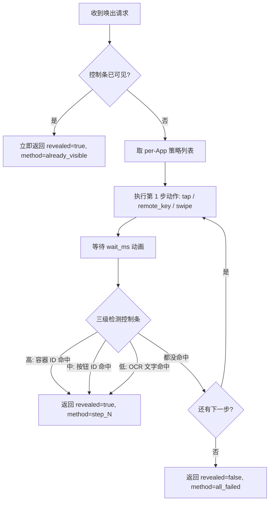
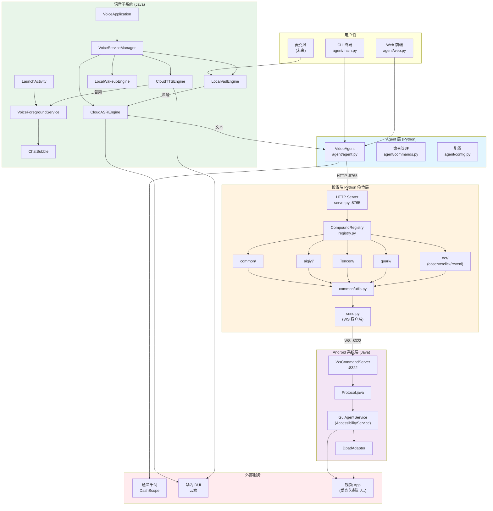

# GUIAgent 项目全景描述

> **项目名**：GUIAgent — 智能电视视频助手
> **仓库**：https://github.com/omit-GitHub/Agent-project
> **目标设备**：华为 AZ102u-10 FTTR 中屏盒（RK3566，Android 9，armeabi-v7a）
> **定位**：通过自然语言（文字或语音）控制客厅电视上的视频 App —— 爱奇艺、腾讯视频、夸克网盘等
> **首次撰写**：2026-08-17
> **架构重构版**：2026-08-17（v2: 从 "Dump + OCR" 升级为 "状态驱动的观测与受控执行层"）
> **重构进度**：Phase 0-2 已落地，Phase 3-8 见 [§九、重构进度跟踪](#九重构进度跟踪)

---

## 一、项目整体架构

项目是一个典型的 **PC/云端 Agent ↔ 设备端 Server ↔ Android 系统能力** 三层结构。用户说话 → Agent 理解意图 → 调设备 HTTP API → 设备翻译成 Android 无障碍动作 → 视频 App 响应。

```
┌─────────────────────────────────────────────────────────────────────┐
│                          用户侧 (PC / 手机 / 平板)                  │
│                                                                     │
│   ┌──────────────┐    ┌──────────────┐    ┌──────────────────────┐ │
│   │  CLI 终端    │    │  Web 前端    │    │  语音输入 (未来)     │ │
│   │ agent/main.py│    │ agent/web.py │    │  麦克风 → ASR        │ │
│   └──────┬───────┘    └──────┬───────┘    └──────────┬───────────┘ │
│          │                   │                       │             │
│          └───────────────┬───┴───────────────────────┘             │
│                          ▼                                         │
│                ┌────────────────────┐                              │
│                │  VideoAgent 核心   │  通义千问 function calling   │
│                │  agent/agent.py    │  多轮对话 + 工具调用         │
│                └─────────┬──────────┘                              │
│                          │ HTTP POST :8765/v1/compound             │
└──────────────────────────┼──────────────────────────────────────────┘
                           ▼
┌──────────────────────────────────────────────────────────────────┐
│                     设备端 Python 命令层                         │
│                                                                  │
│   ┌──────────────────────────────────────────────────────────┐  │
│   │  HTTP Server (server.py, :8765)                          │  │
│   │   ├─ POST /v1/compound  →  CompoundRegistry              │  │
│   │   └─ GET  /v1/health    →  可用命令列表                  │  │
│   └──────────────────────────────────────────────────────────┘  │
│                          │                                       │
│                          ▼                                       │
│   ┌──────────────────────────────────────────────────────────┐  │
│   │  CompoundRegistry (registry.py)                          │  │
│   │   - 串行单线程执行 (15s 超时)                            │  │
│   │   - 命令执行后自动附加 state                             │  │
│   └──────────────────────────────────────────────────────────┘  │
│                          │                                       │
│        ┌─────────────────┼────────────────┬──────────────┐      │
│        ▼                 ▼                ▼              ▼      │
│   ┌─────────┐   ┌─────────────┐   ┌──────────┐   ┌─────────┐  │
│   │ common  │   │   aiqiyi    │   │ Tencent  │   │ quark   │  │
│   │ 通用命令│   │  爱奇艺命令 │   │ 腾讯视频 │   │ 夸克网盘│  │
│   └────┬────┘   └──────┬──────┘   └────┬─────┘   └────┬────┘  │
│        │               │               │              │         │
│        └───────────────┴───────────────┴──────────────┘         │
│                          │                                       │
│                          ▼                                       │
│                 ┌──────────────────┐                             │
│                 │ send.py (WS 客户端)│                           │
│                 │  单指令 NDJSON 一问一答                        │
│                 └────────┬─────────┘                             │
│                          │ WebSocket :8322                       │
└──────────────────────────┼───────────────────────────────────────┘
                           ▼
┌──────────────────────────────────────────────────────────────────┐
│                    Android 系统能力层 (Java)                     │
│                                                                  │
│   ┌──────────────────────────────────────────────────────────┐  │
│   │  GuiAgentService (AccessibilityService)                  │  │
│   │   - onServiceConnected() 起 WsCommandServer              │  │
│   │   - 持有 DpadAdapter (遥控器 / DPAD 适配)                │  │
│   │   - 提供 root() 返回 UI 树                               │  │
│   └──────────────────────────────────────────────────────────┘  │
│                          │                                       │
│                          ▼                                       │
│   ┌──────────────────────────────────────────────────────────┐  │
│   │  WsCommandServer :8322 (RFC 6455 自实现)                 │  │
│   │   ├─ WsHandshake (握手)                                  │  │
│   │   ├─ WsFrame (帧)                                        │  │
│   │   └─ LineHandler → Protocol.handle()                     │  │
│   └──────────────────────────────────────────────────────────┘  │
│                          │                                       │
│                          ▼                                       │
│   ┌──────────────────────────────────────────────────────────┐  │
│   │  Protocol.java (原子操作分发)                            │  │
│   │   ping / dump / find / tap / swipe / gesture / global    │  │
│   │   remote_key / click_node / set_text / scroll_node / ... │  │
│   └──────────────────────────────────────────────────────────┘  │
│                          │                                       │
│                          ▼                                       │
│             AccessibilityNodeInfo / GestureDescription           │
│             (Android 无障碍 API: 点击/滑动/文本/UI树)            │
└──────────────────────────────────────────────────────────────────┘

┌──────────────────────────────────────────────────────────────────┐
│                 并行子系统：华为语音数字人 Shell                  │
│                                                                  │
│   VoiceApplication → VoiceServiceManager → 4 引擎编排           │
│     ├─ CloudASREngine   (云端语音识别)                           │
│     ├─ CloudTTSEngine   (云端语音合成)                           │
│     ├─ LocalVadEngine   (本地语音活动检测)                       │
│     └─ LocalWakeupEngine(本地唤醒词)                             │
│   LaunchActivity → VoiceForegroundService (前台保活)             │
│   ChatBubbleController (悬浮对话气泡 UI)                         │
│   SpeechProvider (DUI 桥接) + AuthUtil (授权)                    │
└──────────────────────────────────────────────────────────────────┘
```

---

## 二、模块详解

### 2.1 Agent 层（`agent/`，Python）

Agent 层是"大脑"，负责理解用户自然语言、决定调哪些设备命令、把执行结果再翻译成人话回给用户。

| 文件 | 职责 |
|---|---|
| `config.py` | 配置管理。从环境变量或 `agent/.env` 读取 `DASHSCOPE_API_KEY`、`DEVICE_IP`、`DEVICE_PORT`、`MODEL_NAME`、`MAX_TOOL_CALLS`、`MAX_HISTORY_TURNS`、`DEBUG` 等 |
| `commands.py` | 命令管理。(1) 通过 `GET /v1/health` 动态获取设备端可用命令列表；(2) 维护内置 `COMMAND_DOCS` 给每个命令配中文描述 + 参数说明 + 例子；(3) 构造 Qwen function calling 的 **tools schema** —— 采用**单函数策略**：一个 `control_device(command, params)` 函数涵盖所有命令，比 54 个独立 function 更省 token |
| `agent.py` | 核心 Agent。`VideoAgent` 类维护多轮对话历史，调用通义千问（DashScope OpenAI 兼容模式），处理 tool_calls → 执行命令 → 回传结果 → 让 LLM 根据结果继续生成回复的循环。同时包含搜索关键词归一化（中文数字→阿拉伯数字、去冗余前缀） |
| `main.py` | CLI 入口。交互式终端对话循环，支持 `/state`、`/commands`、`/reset`、`/stats`、`/debug`、`/help`、`/quit` 等斜杠命令 |
| `web.py` | Web 前端。Flask 服务（默认 :5000），暴露 `/api/chat`、`/api/state`、`/api/commands` 等接口，给浏览器/手机/平板用的聊天 UI |
| `test_agent.py` / `test_detailed.py` | Agent 层的测试脚本 |
| `requirements.txt` | Python 依赖（openai、requests、flask、python-dotenv 等） |

**关键设计点**：

- **单函数 function calling**：`control_device(command, params)` 一个工具涵盖全部命令，命令列表写在 description 里。这样 Qwen 不需要在 54 个 function 之间选，只需要在文本里识别命令名，显著降低 token 消耗。
- **System Prompt 里教 Agent 两种控制方式**：(1) 观察-点击（`observe_screen` → `click_element`，通用）；(2) 命令驱动（直接 `aiqiyi.toggle_play` 等，特定场景）。
- **搜索关键词归一化**：在 Agent 端兜底再做一次（system prompt 里也要求 LLM 做），把"第三季"换成"第3季"、去掉"帮我找一下"这类前缀。

### 2.2 设备端 Python 命令层（`app/src/main/java/com/guiagent/executor/commands/`）

这一层跑在设备端（或同一内网的 PC 上），是 Agent 和 Android 无障碍服务之间的"翻译层"：把 LLM 的高层意图翻译成一系列 WS 原子操作。

#### 2.2.1 `server.py` — HTTP 服务

- 用 Python 标准库 `http.server` + `ThreadingMixIn`（零外部依赖，Android/Termux 友好）
- 两个端点：
  - `POST /v1/compound` — 接收 `{"command": "xxx", "params": {...}}`，路由到 registry
  - `GET /v1/health` — 返回状态 + 已注册命令列表
- `register_all_commands()` 启动时把所有命令 handler 注册到 registry，分 5 组：Common、AiQiyi、Tencent、Quark、OCR

#### 2.2.2 `registry.py` — 命令注册表

对标 Java 版 `CompoundRegistry`，核心类 `CompoundRegistry`：

- **单线程执行器**：`ThreadPoolExecutor(max_workers=1)` 串行化所有命令，避免并发改 UI 状态
- **15s 超时**：`future.result(timeout=15)`，超时返回 `TIMEOUT` 错误
- **自动状态附加**：命令执行后自动 capture 当前前台状态，附到响应的 `data.state` 字段 —— Agent 不用单独调 `get_state` 就知道操作后的状态
- **状态捕获双层策略**（重构 v2 新增）：
  - 轻量轮询：`await_stable()` 用 `capture_state()`（仅 pkg+summary）每 300ms 采一次，最多 8s，等 UI 稳定
  - 富状态附加：稳定后调一次 `observation.state.resolve_state()`，把 `StateSnapshot.to_dict()` 作为 `data.state` —— 包含 `page_type`、`player.{control_bar_visible, is_playing, current_speed, ...}`、`overlay`、`focused_element` 等
- **向后兼容**：`capture_state()` 仍保留（供 polling 用），但对外暴露的状态已从 `{pkg, summary}` 升级为结构化 `StateSnapshot`

#### 2.2.3 命令模块

每个子目录是一个 App 的命令集，每个 `cmd_*.py` / `run_*.py` 是一个具体命令。命名约定：

- `cmd_*.py`：单个原子命令（如 `cmd_toggle_play`）
- `run_*.py`：业务流程（如 `run_episode` 包含 open/select/scroll/next/prev 一组）

| 子模块 | 命令数 | 关键命令 | 状态 |
|---|---|---|---|
| `common/` | 8 | `get_state`、`go_back`、`go_home`、`volume_up/down/mute`、`launcher_search`、`play` | `get_state` v2 重写 |
| `aiqiyi/` | 15 | `toggle_play`、`next/prev_episode`、`select_episode`、`set_speed`、`set_quality`、`brightness_up/down`、`toggle_control_bar`、`open/close_detail`、`open/close_episode_panel`、`scroll_episode_up/down` | v2 待重构 |
| `Tencent/` | 13 | 与爱奇艺基本对称 | v2 待重构 |
| `quark/` | 7 | `launch_app`、`click_navigation`、`scroll_up/down`、`select_file`、`go_back`、`search` | 不动 |
| `observation/` | 4 | `observe_screen`、`click_element`、`reveal_controls` (v2 新)、`resolve_state` (v2 新) | **v2 新子系统** |

#### 2.2.4 `common/utils.py` — 共享工具

所有命令模块的公共基础，提供：

- **响应构造**：`success()`、`success_with_data()`、`error()` —— 对标 Java `CompoundResponse`
- **WS 操作封装**：`tap(x,y)`、`swipe()`、`gesture()`、`click_node_by_id()`、`set_text_by_id()`、`find_nodes()`、`dump()`、`ping()`、`global_action()`、`remote_key()`、`start_app()`、`scroll_node()`
- **UI 树工具**：`find_node_in_tree()`（递归按 ID 子串查找）、`collect_texts()`（DFS 收集可见文本）、`group_by_row()`（按 y 坐标分行）、`detect_columns()`（按 x 坐标检测列数）
- **参数解析**：`parse_count()`、`parse_values()`

#### 2.2.5 `send.py` — WS 客户端

Python 实现的 WebSocket 客户端（无第三方依赖，纯 stdlib）：

- 实现 RFC 6455 握手 + 掩码文本帧发送 + 服务端非掩码帧接收
- 一问一答：`send(req_dict) → resp_dict`
- 环境变量配置：`GUIAGENT_WS_HOST`（默认 127.0.0.1）、`GUIAGENT_WS_PORT`（默认 8322）、`GUIAGENT_WS_PATH`（默认 `/guiagent`）
- 所有 `run-*.py` 只调 `send()`，设置 `GUIAGENT_WS_HOST` 即可在任意内网机器上跑，序列逻辑一字不改

### 2.3 Android 系统能力层（`app/src/main/java/com/guiagent/executor/`）

这一层是 Android 原生代码，作为**无障碍服务**常驻运行，提供对设备 UI 的底层控制能力。

#### 2.3.1 `GuiAgentService.java` — 无障碍服务

- 继承 `AccessibilityService`，用户在「设置→无障碍」开启后常驻
- `onServiceConnected()` 启动 `WsCommandServer`(:8322) + `DpadAdapter`
- 运行时强制置位 `FLAG_REPORT_VIEW_IDS`（关键，否则拿不到 resource-id）
- 提供 `root()` 返回当前活跃窗口的 UI 树根节点
- 提供 `findAllNodesByPattern()` 跨所有窗口搜索节点（清晰度面板等弹窗可能在非活跃窗口）

#### 2.3.2 `WsCommandServer.java` — WebSocket 服务端

- 监听 `0.0.0.0:8322`，自实现 RFC 6455（无第三方 WS 库）
- 拆分：`WsHandshake`（握手）、`WsFrame`（帧）、`LineHandler`（转发）
- 每连接一线程，收到的文本帧交给 `LineHandler` → `Protocol.handle(svc, line)`

#### 2.3.3 `Protocol.java` — 原子操作分发

一行 NDJSON 请求 → 一行 NDJSON 响应。支持的原子操作：

| 操作 | 说明 |
|---|---|
| `ping` | 返回屏幕尺寸、当前 package、activity |
| `dump` | 返回 UI 树（可指定深度和 include 字段） |
| `find` | 按 ID 子串查找节点 |
| `tap` / `long_press` | 坐标点击 / 长按 |
| `swipe` / `gesture` | 滑动 / 多点手势 |
| `click_node` / `long_click_node` | 按节点 ID 点击 |
| `set_text` / `set_text_fallback` | 设置文本（后者走剪贴板降级） |
| `scroll_node` | 滚动节点 |
| `global` | 全局操作（BACK/HOME/RECENTS/SCREENSHOT） |
| `remote_key` | 遥控器按键 |
| `start` | 启动应用 |
| `wait` | 等待 |

#### 2.3.4 辅助类

- `DpadAdapter.java` — 遥控器/DPAD 适配（方向键、确认键）
- `Nodes.java` — UI 树节点工具
- `Match.java` — 节点匹配
- `StateCapture.java` / `StateProvider.java` / `GuiStateProvider.java` — 状态捕获（Java 侧原始实现，Python 版 registry 已替代其功能）
- `LineHandler.java` — WS 行转发
- `WsFrame.java` / `WsHandshake.java` — WS 帧/握手
- `Err.java` — 错误码封装

### 2.4 多模态 UI 观测与状态化执行层（`commands/observation/`，v2 新增）

> **v2 重构核心**：原 `commands/ocr/` 整体升级为 `commands/observation/`。
> 不再以 OCR 为中心，而是提供 4 个协同能力：**状态识别 / 控件唤出 / 焦点导航 / 动作验证**。

#### 2.4.1 设计哲学（v2 重写）

**核心认知**：播放器控制按钮在未唤出时根本不在可观测界面中 —— 没有文字、没有像素、通常也没有无障碍节点。**任何 OCR / 视觉检测都无法定位一个尚未显示的控件。**

所以项目的控制基座从"看见按钮再点"升级为：

> **状态驱动的操作策略 + 控件显式唤出 + DPAD 焦点控制 + 操作后验证。**

按可观测性把页面分三类：

| 页面类型 | 典型例子 | 主控制方式 |
|---|---|---|
| **结构化页面** | 搜索、详情、选集、列表、launcher、文件浏览器 | UI dump 节点优先；OCR 只补文本 |
| **视觉可见但无节点页面** | 自绘/WebView 列表、海报卡片 | 截图语义定位 + 坐标点击 + 截图验证 |
| **隐藏/瞬态控件页面** | 播放器控制条、倍速/清晰度浮层 | `reveal_controls` / DPAD 唤出焦点，再用相对导航或专属动作执行 |

**OCR 的新定位**：OCR 不承担隐藏控件定位，也不单独作为点击依据。系统先通过状态识别判断控件是否应当存在；对播放器等瞬态界面，先执行控件唤出与焦点建立，再采用节点、DPAD 相对导航或视觉坐标完成操作。OCR 仅用于**补全可见文字、辅助候选匹配和验证操作结果**。

#### 2.4.2 `observation/` 子系统结构

```
commands/observation/
├── __init__.py               # 顶层暴露 resolve_state, reveal_controls 等
│
├── state/                    # ★ Phase 0 ✅ UI State Resolver
│   ├── schema.py             #   StateSnapshot + PlayerState 数据类
│   ├── page_classifier.py    #   基于 pkg+activity 快速路径 + UI 树启发式
│   ├── player_state.py       #   控制条/播放状态/倍速/清晰度/选集面板检测
│   └── resolver.py           #   resolve_state() 主入口（ping → dump → classify → detect）
│
├── reveal/                   # ★ Phase 2 ✅ Control Revealer
│   ├── strategies.py         #   per-App 优先级动作序列（数据驱动）
│   ├── detectors.py          #   三级控制条检测（容器 ID / 按钮 ID / OCR 文字）
│   └── revealer.py           #   reveal_controls() 主入口
│
├── dpad/                     # ○ Phase 3（计划中）Focus-Aware DPAD Executor
│   ├── executor.py           #   dpad_press / dpad_navigate / focus_element / dpad_confirm
│   ├── focus_tracker.py      #   a11y 树 diff 检测焦点移动
│   └── keymaps.py            #   per-App DPAD 键位映射 + 导航图
│
├── verify/                   # ○ Phase 4（计划中）Action Verification + Recovery
│   ├── verifier.py           #   verify(predicate, timeout, retries)
│   ├── predicates.py         #   8 个内置谓词（bar_visible, playing_changed, ...）
│   └── recovery.py           #   恢复策略（re-reveal / retry / fail）
│
├── screen/                   # ○ Phase 6（计划中）从 ocr/ 迁移过来
│   ├── cmd_observe_screen.py #   原 ocr/cmd_observe_screen.py
│   └── cmd_click_element.py  #   原 ocr/cmd_click_element.py
│
├── ocr/                      # ○ Phase 6（计划中）OCR 引擎降为子模块
│   └── ocr_engine.py         #   从 cmd_observe_screen.py 抽出
│
└── tests/                    # 单元测试
    └── test_state_resolver.py  # 35 个单测，全通过 ✅
```

#### 2.4.3 UI State Resolver（Phase 0 ✅）

**文件**：`observation/state/resolver.py`
**入口**：`resolve_state() → StateSnapshot`
**职责**：采集当前设备状态并返回结构化快照。

**StateSnapshot 关键字段**（详见 `schema.py`）：

```python
StateSnapshot:
  pkg, activity, summary              # 兼容旧 schema
  screen_version                       # 与 observe_screen 同格式
  page_type                            # structured | visual | player | unknown
  app_category                         # video_player | file_browser | launcher | ...
  player: Optional[PlayerState]        # 播放器子状态（非播放器场景为 None）
    .control_bar_visible               # ★ 关键字段：决定要不要先 reveal_controls
    .is_playing, current_speed, current_quality
    .episode_panel_open, focused_element_id
  overlay                              # speed_panel | quality_panel | episode_panel | ...
  focused_element, dump_status, screen_size
```

**Page Type 分类**（`page_classifier.py`）：
- **快速路径**：pkg+activity 查表（我们只对接 3 个 App + launcher，查表吊打 ML 分类器）
- **兜底**：UI 树启发式（节点 ID 含 `playerControlBar` / `episodeGridView` 等 → player）

**接入点**（`registry.py` / `cmd_get_state.py`）：
- Seam 1（已实现）：`registry._attach_state()` 在 `await_stable` 后调一次 `resolve_state()`，富状态自动附到每个命令响应的 `data.state`
- Seam 2（已实现）：`common/cmd_get_state.py` 重写为调 `resolve_state()`，命令名不变、schema 扩展

#### 2.4.4 Control Revealer（Phase 2 ✅）

**文件**：`observation/reveal/revealer.py` + `strategies.py` + `detectors.py`
**入口**：`reveal_controls(app=None, context=None, max_steps=4) → dict`
**替代**：旧 `ocr/cmd_reveal_controls.py`（硬编码 `tap(640, 400)`，无 per-App 特化，无验证）—— **已删除**。

**工作流**：



**Per-App 策略示例**（`strategies.py`）：

```python
AIQIYI_STRATEGY = [
    {"action": "tap", "args": {"x": 640, "y": 200}, "wait_ms": 1200},  # 顶部中央
    {"action": "remote_key", "args": {"key": "ENTER"}, "wait_ms": 1000},
    {"action": "remote_key", "args": {"key": "MENU"}, "wait_ms": 1200},
]
```

**三级检测**（`detectors.py`）：
- 高置信度：a11y 树含控制条容器节点（`playerControlBar` 等）
- 中置信度：a11y 树含典型按钮 ID（`btn_pause`, `im_play_next` 等）
- 低置信度：OCR 找到控制文字（暂停/选集/倍速等），且 ≥2 个匹配

#### 2.4.5 DPAD Executor（Phase 3 — 计划中）

**目标**：对播放器设置、选集、清晰度等浮层，优先使用"从已知初始焦点按 N 次方向键"的相对导航，而不是绝对坐标。

**4 级 API**：
1. `dpad_press(key)` — 单次按键 + 焦点追踪
2. `dpad_navigate(direction, count)` — 多次连续导航
3. `focus_element(target_id/target_text)` — 目标导向导航
4. `dpad_confirm()` — 在当前焦点元素上按 DPAD ENTER

**焦点追踪**：通过 `focused=true` 属性在 a11y 树里的位置变化判断。

#### 2.4.6 Action Verification（Phase 4 — 计划中）

**目标**：每个高层操作必须有成功判定，而不只是"tap 调用了且未报错"。

**8 个内置谓词**：
- `bar_visible(app)` — 控制条出现
- `playing_state_changed(expected)` — 播放/暂停状态翻转
- `episode_changed(expected_ep)` — 集数变化
- `speed_changed(expected)` / `quality_changed(expected)` — 倍速/清晰度变化
- `overlay_appeared(type)` — 浮层出现
- `node_present(id_substr)` / `text_present(text_substr)` — 通用存在性

**verify_after_action(action_fn, predicate, recover_fn, max_retries=1)**：
自动走"执行 → 验证 → 失败则 recover → 重试一次"流程。命令层内部消化，Agent 只看最终 `verification.verified`。

#### 2.4.7 Harness 在 v2 中的新角色（关键架构变化）

**Harness 定义**：LLM（大脑）和设备命令（手脚）之间的机械编排层。

**当前三层 harness 分布**：
- Agent 侧：`agent/agent.py` 的 `_chat_loop()` + `_execute_command()`（工具循环 + 5 次预算）
- Registry 侧：`CompoundRegistry`（单线程 + 15s 超时 + 状态 attach）
- 命令侧：`common/utils.py`（响应格式 + WS 封装 + UI 树工具）

**v2 新增的 harness 职责**：

| 职责 | 当前 | v2 |
|---|---|---|
| 前置条件检查 | 仅搜索关键词归一化 | 调 State Resolver 判断 state → 决定能不能执行 |
| 控制唤出 | 没有（每个命令盲 tap） | 统一 Control Revealer，带 per-App 优先级动作序列 |
| 焦点导航 | 几乎没有 | DPAD Executor 抽象 |
| 后置验证 | 没有 | 每个命令带验证谓词；失败自动重观察→重唤出→重试 |

**关键的"机械重试 vs 语义重试"分工**：
- **Harness 负责机械重试**（deterministic, bounded）：控制条没唤出 → 换下一个动作；DPAD 失焦 → 再按一次
- **LLM 负责语义重试**（needs reasoning）：走错页面 → 决定按几次返回；目标不存在 → 决定换候选；多次机械重试都失败 → 决定放弃并解释

这让 LLM 不再需要推理"控制条怎么唤出"这种机械逻辑，显著省 token、提高可靠性。

### 2.5 华为语音数字人 Shell（`app/src/main/java/com/huawei/aifttr/digitalpersonshell/`）

这是并行的**语音输入子系统**，目标是替代 Agent 层目前的文字输入，实现"用户说话 → 设备本地处理 → 控制视频"。

#### 2.5.1 模块组织

```
digitalpersonshell/
├── VoiceApplication.java          # Application 入口，装配语音服务
├── constants/
│   ├── ChatConfig.java            # 对话配置
│   ├── VoiceConfig.java           # 语音配置
│   └── VoiceServiceConstants.java # 引擎数量等常量
├── data/model/
│   ├── entities/chat/ChatRequest.java
│   ├── enums/SpeakerType.java
│   └── session/{ConversationPhase, ConversationUiModel, VoiceSession}.java
├── recorder/
│   ├── IRecorder.java / Recorder.java / RecorderListener.java
├── sdk/
│   ├── api/                       # 接口定义
│   │   ├── IASREngine.java        # 语音识别
│   │   ├── ISpeechProvider.java   # DUI 桥接
│   │   ├── ITTSEngine.java        # 语音合成
│   │   ├── IVadEngine.java        # 语音活动检测
│   │   └── IWakeupEngine.java     # 唤醒词
│   ├── AuthUtil.java              # 授权
│   ├── SpeechProvider.java        # DUI 实现
│   └── impl/                      # 引擎实现 + 配置
│       ├── ASREngineHelper.java
│       ├── TTSEngineHelper.java
│       ├── VadEngineHelper.java
│       ├── WakeupEngineHelper.java
│       └── WakeupConfigSpec.java
├── services/
│   ├── engines/                   # 4 大引擎包装
│   │   ├── CloudASREngine.java
│   │   ├── CloudTTSEngine.java
│   │   ├── LocalVadEngine.java
│   │   └── LocalWakeupEngine.java
│   ├── interfaces/                # 接口
│   │   ├── BubbleUiCallback.java
│   │   ├── ChatCallback.java
│   │   ├── ChatSocketListener.java
│   │   ├── IpSupplier.java
│   │   ├── IVoiceService.java
│   │   ├── WebSocketConnection.java
│   │   └── WebSocketFactory.java
│   ├── OkHttpWebSocketFactory.java
│   ├── SerialEventDispatcher.java
│   ├── VoiceGateway.java
│   ├── VoiceServiceManager.java   # 4 引擎编排
│   └── WebSocketChatService.java
├── ui/
│   ├── LaunchActivity.java        # 极简启动载体，申请录音权限后启前台服务
│   ├── VoiceForegroundService.java # 前台保活服务
│   └── bubble/                    # 悬浮对话气泡
│       ├── ChatBubbleController.java
│       ├── ChatBubblePresenter.java
│       ├── IBubbleView.java
│       └── VoiceOrbView.java
└── utils/
    ├── IpUtils.java
    ├── MarkdownText.java
    └── log/{FileUtil, LogConfig, LogFilter, Logger}.java
```

#### 2.5.2 工作流

1. `VoiceApplication.onCreate()` 初始化 `SpeechProvider`（DUI）+ `VoiceServiceManager`
2. `VoiceServiceManager` 先做授权，然后依次初始化 4 个引擎（ASR、TTS、VAD、Wakeup），全部就绪后回调 `onSuccess`
3. `LaunchActivity` 申请 `RECORD_AUDIO` 权限后启动 `VoiceForegroundService` 并 self finish
4. `VoiceForegroundService` 是前台保活载体（无 UI 场景下的常驻进程）
5. 用户说话 → `Recorder` 采集音频 → `LocalVadEngine` 检测语音段 → `CloudASREngine` 识别 → 文本给到 Agent（未来）→ `CloudTTSEngine` 回复
6. `ChatBubbleController` 在屏幕上绘制悬浮对话气泡，显示 ASR 识别结果和 TTS 回复

#### 2.5.3 关键能力

- **云端 ASR/TTS**：依赖华为 DUI 服务，需要授权
- **本地 VAD/Wakeup**：离线可用，`LocalWakeupEngine` 监听唤醒词
- **Barge-in 处理**：`VoiceServiceManager` 内部有 `CaptureMode` 状态机（IDLE / FESPX_ASR / BARGE_DETECT / BARGE_ASR_FLUSH / BARGE_ASR），支持用户在 TTS 播报时打断
- **声纹已裁剪**：原项目有声纹识别，本项目已移除（`VoicePrintRemovalGuardTest.java` 是裁剪后的 guard 测试）

### 2.6 顶层脚本和文档

| 文件 | 用途 |
|---|---|
| `README.md` | 编译部署手册（Mac 本机编译 + 设备扫描 + adb 安装 + 启动） |
| `agent/README.md` | Agent 框架使用说明（快速开始、使用示例、配置项、架构图） |
| `PROJECT_OVERVIEW.md` | **本文件** — 项目全景描述（v2 重构版） |
| `Dump+OCR实现说明.md` | v2.1 版本 Dump+OCR 实现细节（**v1 历史文档**） |
| `增强Dump+OCR融合方案.md` | 增强方案设计文档（含 mermaid 流程图，**v1 历史文档**） |
| `http_service_guide.md` | HTTP 服务指南 |
| `run-search.py` | 顶层演示脚本：搜索片源（走 whohuatv launcher） |
| `generate_project_summary_pdf.py` | 项目摘要 PDF 生成脚本 |
| `Tencent/readme_tencent.md` | 腾讯视频适配说明 |
| `aiqiyi/readme_aiqiyi.md` + `run-episode.py` | 爱奇艺适配说明 + 选集演示 |

**v2 重构方案**（本地 plan 文件，未提交到仓库）：
- `~/.claude/plans/concurrent-snuggling-ritchie.md` — 完整重构设计（~1000 行），含 harness 架构、4 个新能力设计、迁移策略、文件清单

---

## 三、模块间关系与数据流

### 3.1 主链路（用户说话到视频响应，v2 更新）

```
1. 用户输入 (文字 / 语音)
      │
      ▼
2. [agent/agent.py] VideoAgent.chat()
   - 拼接 system prompt + 历史 + 用户消息
   - 调 Qwen (DashScope, OpenAI 兼容模式)
   - Qwen 返回 tool_calls: control_device(command, params)
      │
      ▼
3. [agent/agent.py] _execute_command()
   - HTTP POST http://{DEVICE_IP}:8765/v1/compound
   - body: {"command": "aiqiyi.toggle_play", "params": {}}
      │
      ▼
4. [commands/server.py] CompoundHandler._handle_compound()
   - 解析 body
   - 调 registry.execute(command, params)
      │
      ▼
5. [commands/registry.py] CompoundRegistry.execute()
   - 单线程执行器提交 handler
   - 15s 超时保护
      │
      ▼
6. [commands/aiqiyi/run_toggle.py] run(params)   ← v2 新流程
   - a. resolve_state() 检查 page_type == 'player'
   - b. 若 control_bar 不可见 → reveal_controls(app) 唤出
   - c. 执行核心动作（click_node / dpad_navigate）
   - d. verify_after_action() 验证结果
      │
      ▼
7. [observation/state/resolver.py] resolve_state()
   - ping → dump → classify → detect_player → assemble StateSnapshot
      │
      ▼
8. [observation/reveal/revealer.py] reveal_controls()
   - 取 per-App 策略 → 依次执行动作 → 三级检测控制条是否出现
      │
      ▼
9. [observation/verify/verifier.py] verify_after_action()
   - 执行 action → 验证谓词（bar_visible / playing_changed / ...）
   - 失败 → recover + 重试一次 → 返回 verification 结果
      │
      ▼
10. [commands/send.py] send(req)
    - 纯 Python WebSocket 客户端
    - 发到 ws://127.0.0.1:8322/guiagent
      │
      ▼
11. [Java] WsCommandServer :8322
    - 收到文本帧 → LineHandler → Protocol.handle()
      │
      ▼
12. [Java] Protocol.java 分发
    - 根据 op 字段调用对应 Android 无障碍 API
    - 例如 op=tap → svc.dispatchGesture(tap x,y)
      │
      ▼
13. Android 系统执行
    - AccessibilityService 注入点击/滑动/文本
    - 视频 App 响应（暂停、换集、跳进度等）
      │
      ▼
14. 响应原路返回
    - Protocol → WsFrame → send.py → utils → run_*.py
    - registry 调 resolve_state() 获取富状态，附到 data.state
    - server.py → HTTP 响应
    - agent.py 拿到结果（含 verification.verified + state）
      → 让 Qwen 生成自然语言回复
      │
      ▼
15. 用户看到回复 (CLI / Web / 语音 TTS)
```

**v2 vs v1 主链路关键差异**：
- v1 步骤 6 只做"盲 tap + sleep"，无状态检查、无唤出、无验证
- v2 步骤 6 内部分解为 **resolve → reveal → act → verify** 四步，harness 自动处理机械细节
- v2 步骤 14 返回富状态 `StateSnapshot`（含 page_type, player state 等），Agent 看到完整场景信息

### 3.2 调用方向矩阵

| 调用方 → 被调方 | 协议 | 端口 | 方向 |
|---|---|---|---|
| agent.py → server.py | HTTP JSON | 8765 | PC → 设备 |
| server.py → registry.py | 进程内函数 | — | 同进程 |
| registry.py → cmd_*.py | 进程内函数 | — | 同进程 |
| cmd_*.py → send.py | 进程内函数 | — | 同进程 |
| send.py → WsCommandServer | WebSocket NDJSON | 8322 | PC → 设备（或设备本机） |
| WsCommandServer → Protocol | 进程内 Java | — | 同进程 |
| Protocol → GuiAgentService | 进程内 Java | — | 同进程 |
| GuiAgentService → Android 系统 | Accessibility API | — | 系统调用 |
| LaunchActivity → VoiceForegroundService | Android Intent | — | 同进程 |
| VoiceServiceManager → 4 引擎 | 进程内 Java | — | 同进程 |
| 4 引擎 → 华为 DUI / 云端 | HTTPS / 本地 so | — | 出站 |

### 3.3 进程边界

实际运行时涉及 3 类进程：

1. **Android App 进程**（`com.huawei.aifttr.digitalpersonshell`）
   - `GuiAgentService` (无障碍服务，常驻)
   - `VoiceApplication` → `VoiceServiceManager` → `VoiceForegroundService`
   - 内含 `WsCommandServer :8322`

2. **Python 命令服务进程**（`python server.py`）
   - `server.py` HTTP :8765
   - `registry.py` + 所有命令模块
   - 通过 WS 客户端连回本机的 :8322

3. **Agent 进程**（`python agent/main.py` 或 `agent/web.py`）
   - `VideoAgent` + Qwen API 调用
   - 通过 HTTP 连到 :8765
   - 可以跑在 PC、手机、或设备本机

---

## 四、技术栈总结

| 层 | 技术 | 说明 |
|---|---|---|
| **大模型** | 通义千问 (DashScope) | qwen-plus / qwen-max / qwen-turbo，OpenAI 兼容模式 |
| **Agent 语言** | Python 3 | 标准库为主，依赖 openai、requests、flask、python-dotenv |
| **Android 语言** | Java (JDK 17) | 走 Android AccessibilityService |
| **构建** | Gradle 9.0.0 | 不用 `./gradlew`，用本地 binary |
| **WS 实现** | 自实现 RFC 6455 | Java 服务端 + Python 客户端，无第三方库 |
| **HTTP 服务** | Python `http.server` | `ThreadingMixIn` 多线程，零依赖 |
| **OCR** | `rapidocr_onnxruntime` | 概念验证阶段 |
| **语音** | 华为 DUI + 4 引擎 | ASR/TTS 走云，VAD/Wakeup 本地 |
| **目标设备** | Android 9, armeabi-v7a | RK3566 芯片，华为 FTTR 中屏盒 |
| **前端** | HTML + Flask 模板 | 聊天 UI，端口 5000 |

---

## 五、关键设计决策

### 5.1 为什么命令层从 Java 迁到 Python

Java 侧原本有完整的 `CompoundRegistry` + 所有命令实现。迁移到 Python 的好处：

- **迭代速度**：Python 改完即跑，不需要重新编译 APK
- **调试友好**：print/traceback 比 logcat 方便
- **Agent 协同**：Agent 也是 Python，命令模块和 Agent 可以共享代码（如搜索归一化）
- **跨平台**：命令服务可以在 PC 上跑，经 adb forward 或设备 IP 直连

Java 侧**只保留 WS 原子操作**（:8322），因为这部分必须调 Android 无障碍 API，离不开 Java。

### 5.2 为什么用单函数 function calling

54 个独立 function 会让 Qwen 的 function calling 决策空间爆炸，token 消耗巨大。单函数 `control_device(command, params)` 把命令列表写在 description 里，模型只需要在文本里识别命令名，省 token 也更容易 prompt 调优。

### 5.3 为什么 registry 要串行化

UI 操作天然是串行的 —— 同时 tap 两个地方没意义，反而可能让 UI 进入不确定状态。`max_workers=1` 的执行器保证命令一个接一个执行，配合 `await_stable()` 等待 UI 稳定再返回，让 Agent 永远看到一致的状态。

### 5.4 为什么从 Dump + OCR 升级为状态驱动的观测与受控执行层（v2 重写）

**旧方案的逻辑漏洞**：原 §2.4.1 的"dump 失效时才降级为 OCR 文本框中心点击"策略对普通列表页尚可，但对播放器页是错的 —— OCR 框中心不是按钮真实热区；隐藏控制栏没有 OCR 结果，更谈不上点击。

**核心认知升级**：播放器控制按钮在未唤出时根本不在可观测界面中。任何 OCR / 视觉检测都无法定位一个尚未显示的控件。所以控制基座必须从"看见按钮再点"升级为"状态驱动 + 显式唤出 + 焦点导航 + 动作验证"。

**新框架**：
- **状态识别**：`resolve_state()` 给出结构化状态，Agent 决策单位从"截图中有哪些字"升级为"当前处于什么状态"
- **显式唤出**：`reveal_controls()` 用 per-App 策略序列 + 三级检测，把隐藏控件唤出来
- **DPAD 焦点**：对播放器浮层优先用"从已知焦点按 N 次方向键"，而不是绝对坐标
- **动作验证**：每个操作带验证谓词，失败自动恢复
- **Harness 增强**：harness 承担机械性责任（precondition / reveal / retry），LLM 专注于语义决策

### 5.5 为什么语音子系统和 Agent 子系统并行存在

- Agent + 文字输入：快速迭代、易调试、模型能力可以迅速升级
- 语音数字人 Shell：本地唤醒、本地 VAD、云端 ASR/TTS，目标是不依赖远端 Agent 也能跑（离线可用部分能力）

最终形态可能是：**语音 Shell 作为输入层，Agent 作为大脑，两者通过 WebSocket/HTTP 对接**。

---

## 六、构建与部署流程

```
1. 编译 APK
   gradle :app:assembleDebug
   产物: app/build/outputs/apk/debug/app-debug.apk (~35MB)

2. 扫描定位设备 (DHCP IP 末段会变)
   ping 扫 192.168.100.0/24 → nc 5555 找 adb 端口

3. 连接设备
   adb connect <IP>:5555

4. 安装
   adb uninstall <pkg> (可选)
   adb install <apk>

5. 启动
   adb shell am start -n <pkg>/.ui.LaunchActivity
   → 申请录音权限
   → 启动 VoiceForegroundService
   → VoiceApplication.onCreate() 装配语音服务

6. 开启无障碍服务
   设置 → 无障碍 → GUIAgent → 开启
   → GuiAgentService.onServiceConnected()
   → WsCommandServer :8322 起来

7. 启动 Python 命令服务
   python app/src/main/java/com/guiagent/executor/commands/server.py
   → HTTP :8765 起来

8. 启动 Agent
   python agent/main.py      # CLI
   python agent/web.py       # Web UI
```

---

## 七、模块关系图（Mermaid）



---

## 八、扩展方向

1. **语音输入上线**：把语音子系统的 ASR 输出直接喂给 VideoAgent，实现全链路语音控制
2. **多模态**：截图发给 Qwen-VL，让模型"看到什么说什么"，作为 observe_screen 的补充
3. **更多 App**：优酷、芒果 TV、B 站等，按 `android-video-app-adapter` skill 的套路适配
4. **YOLO 替换 OCR**：把启发式 UI 元素分类升级为视觉模型
5. **记忆与学习**：Agent 记住"用户家电视的搜索框 ID 是 xxx"，跨会话复用
6. **多设备协同**：一个 Agent 同时控制多台电视（会议室、酒店场景）

---

## 九、重构进度跟踪（v2）

> 完整设计方案：`C:\Users\p30068177\.claude\plans\concurrent-snuggling-ritchie.md`
> 重构目标：从 "Dump + OCR" 升级为 "状态驱动的观测与受控执行层"

### Phase 状态总览

| Phase | 标题 | 状态 | 关键产出 |
|---|---|---|---|
| **0** | Foundation — State Resolver | ✅ 完成 | `observation/state/{schema, page_classifier, player_state, resolver}.py` + 35 个单测全通过 |
| **1** | State Resolver 集成 | ✅ 完成 | `registry.py._attach_state()` 改用 `resolve_state()`；`cmd_get_state.py` 重写返回富状态；真实设备验证通过 |
| **2** | Control Revealer | ✅ 完成 | `observation/reveal/{strategies, detectors, revealer}.py`；per-App 策略 + 三级检测；删旧 `ocr/cmd_reveal_controls.py`；server.py 注册新 `reveal_controls` |
| **3** | Focus-Aware DPAD Executor | ○ 计划中 | `observation/dpad/{executor, focus_tracker, keymaps}.py` |
| **4** | Verification Framework | ○ 计划中 | `observation/verify/{verifier, predicates, recovery}.py` + 8 个内置谓词 |
| **5** | 重构现有播放器命令 | ○ 计划中 | aiqiyi + Tencent 的 run_toggle/run_speed/run_resolution/cmd_toggle_control_bar 用新的 reveal→verify→dpad→verify 模式重写 |
| **6+7** | 重命名 ocr/ → observation/ + Agent 层更新 | ○ 计划中 | 移动 `ocr/*` 到 `observation/screen/` + `observation/ocr/`；SYSTEM_PROMPT 重写教三类页面模型；MAX_TOOL_CALLS 5→8 |
| **8** | 文档更新 | 🔄 进行中 | 本文件 PROJECT_OVERVIEW.md 已更新 §2.4 / §3.1 / §5.4 / 新增 §9 |

### Phase 0-2 关键成果

**Phase 0 — State Resolver**（新增文件 6 个，单测 35 个）

```
observation/
├── __init__.py
├── state/
│   ├── __init__.py
│   ├── schema.py             # StateSnapshot + PlayerState 数据类
│   ├── page_classifier.py    # pkg+activity 查表 + UI 树启发式
│   ├── player_state.py       # 控制条/播放状态/倍速/清晰度/选集面板检测
│   └── resolver.py           # resolve_state() 主入口
└── tests/
    └── test_state_resolver.py
```

**Phase 1 — 集成**（改动 2 个文件）

- `registry.py`：`_attach_state()` 现在稳定后调一次 `resolve_state()` 附富状态
- `common/cmd_get_state.py`：重写为调 `resolve_state()`，返回 ~12 字段增强 schema
- **真实设备验证**：`get_state` 成功返回 `page_type: "structured"`, `app_category: "launcher"` 等正确分类

**Phase 2 — Control Revealer**（新增 4 文件，删 1 文件，改 1 文件）

```
observation/reveal/
├── __init__.py
├── strategies.py       # AIQIYI/TENCENT/QUARK/DEFAULT 策略列表
├── detectors.py        # 三级检测（容器 ID / 按钮 ID / OCR 文字）
└── revealer.py         # reveal_controls() 主入口

已删除: ocr/cmd_reveal_controls.py
已修改: server.py（注册新 reveal_controls 替代旧）
```

**端到端验证**（Phase 2 完成后）：
- Server 注册 47 个命令，`reveal_controls` / `observe_screen` / `click_element` 全部正确注册
- Detector 测试：`high/container_id`、`medium/button_id`、`none` 三级都按预期工作
- 策略查找：3 个 App 各 3 步策略，未知 App 自动 fallback 到 default

### 下一步工作

- **Phase 3**: 实现 `observation/dpad/`（DPAD Executor + 焦点追踪）
- **Phase 4**: 实现 `observation/verify/`（Verifier + 8 个谓词 + Recovery）
- **Phase 5**: 用新原语重写 aiqiyi + Tencent 的 8 个播放器命令
- **Phase 6+7**: 重命名 + SYSTEM_PROMPT 重写
- **Phase 8**: 完成本文件剩余部分（§7 Mermaid 图重绘）

---

**文档结束**

本文件是 GUIAgent 项目的完整逐字描述，覆盖所有模块的职责、接口、数据流和设计决策。**v2 架构重构**正在推进中（Phase 0-2 已落地，Phase 3-8 见本章状态表）。配合 `README.md`（编译部署）、`agent/README.md`（Agent 使用）、完整重构方案 `~/.claude/plans/concurrent-snuggling-ritchie.md` 一起阅读，可完整理解整个项目。
