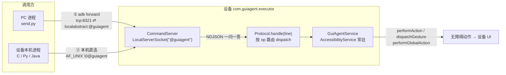

# GUIAgent

寄生型 Android 无障碍服务 APP + 一套载体无关的指令协议。APP 装到中屏（或任意 Android 设备）后常驻一个 `AccessibilityService`，并在 `onServiceConnected` 起一个**抽象命名空间 socket 服务** `@guiagent`，接收一行 NDJSON 指令、翻译为无障碍动作后回一行响应。

调用方可以是 **PC（经 adb 隧道）**，也可以是**设备本机任意进程（直连抽象 socket）**——两者发的字节完全一致，仅传输载体不同。

> 指令格式与语义见 [`instruction-protocol.md`](instruction-protocol.md)（v1.2）。本文档是使用指南。

---

## 架构



纯文本流向（不渲染 Mermaid 时看这里）：

```
调用方 ──NDJSON──▶ CommandServer(@guiagent) / WsCommandServer(:8322) ──▶ Protocol.dispatch(op) ──▶ GuiAgentService
  PC     : adb forward tcp:8321 ⇄ localabstract:@guiagent  (TCP 隧道,载体 A)
  本机   : AF_UNIX  "\0@guiagent"                           (抽象 socket 直连,载体 B)
  内网   : ws://<设备IP>:8322/guiagent                       (WebSocket 文本帧,载体 C)
                                                  └─▶ AccessibilityNodeInfo / dispatchGesture / performGlobalAction
```

- **两种载体，指令字节完全一致**：PC 走 adb TCP 隧道、设备本机走 AF_UNIX 抽象 socket，adb 仅作网络隧道不参与语义。

- **APP**：`app/`，`applicationId = com.guiagent.executor`，纯 Java，无 AndroidX、无 UI、无 native 库 → 通用 APK，`minSdk 24`，`targetSdk 34`，`versionName 0.1.0`。
- **指令分发**：[`Protocol.java`](app/src/main/java/com/guiagent/executor/Protocol.java) — `dispatch` 按 `op` 路由。
- **Socket 服务**：[`CommandServer.java`](app/src/main/java/com/guiagent/executor/CommandServer.java) — `onServiceConnected` 时起 `LocalServerSocket("@guiagent")`，每连接独立线程，`while` 循环读一行回一行（支持长连接连发）。
- **无障碍实现**：[`GuiAgentService.java`](app/src/main/java/com/guiagent/executor/GuiAgentService.java) — 节点级 `performAction` + 坐标级 `dispatchGesture`。

---

## 一、构建与安装

```bash
# 1. 构建 debug APK(Windows 用 .\gradlew.bat)
./gradlew assembleDebug
# 产物: app/build/outputs/apk/debug/app-debug.apk

# 2. 装到设备
adb -s <serial> install -r app/build/outputs/apk/debug/app-debug.apk
```

> Gradle 仓库已配阿里云镜像（见 `settings.gradle.kts`）。`local.properties` 里 `sdk.dir` 指向本机 Android SDK。

---

## 二、开启无障碍服务（必做）

GUIAgent 的所有能力都挂在 `AccessibilityService` 上，不开则任何指令都返回 `err.code = SVC_DOWN`。

中屏上手动：**设置 → 无障碍 → 已安装服务 → GUIAgent → 开启**。

或用 adb 一次性开启（设备需已装本 APP）：

```bash
adb shell settings put secure enabled_accessibility_services com.guiagent.executor/com.guiagent.executor.GuiAgentService
adb shell settings put secure accessibility_enabled 1
```

开启后 `CommandServer` 随服务常驻，抽象 socket `@guiagent` 即开始接客。可用 `ping` 验证（见下）。

### 关键点：无障碍服务的启动机制与持久性

- **不能由 APP 自启动拉起**：`GuiAgentService` 是 `AccessibilityService`，生命周期由系统 `AccessibilityManager` 管理——仅当 `settings.secure.enabled_accessibility_services` 含本服务时由系统自动绑定，APP 自身无法 `startService`/`bindService` 拉起，也无权把自己写进该 setting（需 `WRITE_SECURE_SETTINGS`）。故"把 APP 做成开机自启"替代不了"开无障碍"这一步。
- **开关持久、重启不丢**：`enabled_accessibility_services` 存于 `settings.secure`，写入即持久，重启后仍生效（adb 写入与手动开启同等持久）。验证：
  ```bash
  adb -s <serial> reboot
  # 重启后查 8322(0x2082) 是否仍 LISTEN（状态 0A）
  adb -s <serial> shell "cat /proc/net/tcp /proc/net/tcp6" | grep -i 2082
  ```
- **服务一旦 enabled，由系统常驻绑定**：`AccessibilityService` 优先级高于普通前台服务，进程被杀系统会自动重启它，**无需自写保活逻辑**。`onServiceConnected` 里起的 `CommandServer`/`WsCommandServer` 随之恢复。
- **真正会失效的场景**：① 用户手动关；② 部分 ROM 省电/清理策略强制禁用；③ 覆盖安装后某些 ROM 要求重新确认。这些 APP 层无法阻止，只能 adb 重新 `settings put` 恢复或引导用户重开。
- **想做"自启动"的正解**：注册 `BOOT_COMPLETED`（加 `RECEIVE_BOOT_COMPLETED` 权限 + receiver），开机后起一个引导 Activity/通知，检测服务未启用即跳转无障碍设置页让用户一键开启——**引导授权，而非拉起服务**。
- **想完全免授权**：需 Shizuku（免 root，shell 权限静默 `settings put` 或用 `UiAutomator` 替代无障碍）或 root，但前者要重写执行层（`dispatchGesture` → `input`/`UiAutomator`），工作量与收益需权衡。

---

## 三、使用指南

### 载体 A：PC 经 adb 隧道直连

适用：在 PC 上用 [`send.py`](send.py) / [`run-search.py`](run-search.py) 驱动设备。

```bash
# 1. 建隧道(每次设备重连后重做)
adb forward tcp:8321 localabstract:@guiagent
#   注意 localabstract: 后面要带 @,与代码 LocalServerSocket("@guiagent") 名字对齐
#   adb forward --list 可查;forward --remove tcp:8321 可撤

# 2. 发指令(Windows 下用 python 并开 UTF-8,避免中文关键词乱码)
set PYTHONUTF8=1
python send.py "{\"id\":\"1\",\"op\":\"ping\",\"args\":{}}"

# 3. 跑搜索
python run-search.py 庆余年
```

`send.py` 内部走 `socket.create_connection(("127.0.0.1", 8321))`，即 PC 本地 TCP → adb daemon → 设备抽象 socket `@guiagent`。adb 在此仅作网络隧道，不参与语义。

### 载体 B：设备本机进程直连

适用：中屏上的后台进程（daemon / 脚本 / 其他 APP）不经过 PC 与 adb，直接调用 GUIAgent。

抽象 socket 是系统级 AF_UNIX 机制，**与本机进程是不是 APP 无关**。任何本机进程用 `AF_UNIX` 连 `\0@guiagent` 即可，指令字节与载体 A 完全一致。

**Python（Termux 或任意带 python 的本机进程）**：

```python
import socket, json
ADDR = "\0@guiagent"           # AF_UNIX abstract: \0 + 名字 "@guiagent"

def send(req, timeout=15):
    s = socket.socket(socket.AF_UNIX, socket.SOCK_STREAM)
    s.settimeout(timeout); s.connect(ADDR)
    try:
        s.sendall((json.dumps(req, ensure_ascii=False) + "\n").encode("utf-8"))
        buf = b""
        while b"\n" not in buf:
            c = s.recv(8192)
            if not c: break
            buf += c
        first = buf.split(b"\n", 1)[0]
        return json.loads(first.decode("utf-8")) if first else {}
    finally:
        s.close()

print(send({"id":"1","op":"ping","args":{}}))
```

**C / native daemon**：

```c
#include <sys/socket.h>
#include <sys/un.h>
#include <string.h>

int connect_guiagent(void) {
    int fd = socket(AF_UNIX, SOCK_STREAM, 0);
    struct sockaddr_un addr;
    memset(&addr, 0, sizeof(addr));
    addr.sun_family = AF_UNIX;
    addr.sun_path[0] = '\0';                 /* 抽象命名空间标记 */
    const char *name = "@guiagent";          /* 名字字面量,含 @ */
    memcpy(&addr.sun_path[1], name, strlen(name));
    socklen_t len = sizeof(sa_family_t) + 1 + strlen(name); /* 抽象名无需 null 结尾 */
    connect(fd, (struct sockaddr *)&addr, len);
    return fd;
    /* 之后写一行 JSON + '\n',读至第一个 '\n' 即响应 */
}
```

**Java/Kotlin（另一个 APP 进程）**：用 `android.net.LocalSocket` + `LocalSocketAddress("@guiagent", LocalSocketAddress.Namespace.ABSTRACT)`，写一行读一行。

### 载体 B — Java `app_process` 方案（已验证）

设备自带的 `app_process` 是现成 Java 运行时，能把一个 dex 当作**设备本机进程**跑——不需在设备上装 Python、也不需交叉编译 native。它走 `android.net.LocalSocket` 连 `@guiagent`，与 C/Python 方案同一抽象 socket、同一指令字节。源码 [`c-client/G.java`](c-client/G.java)，封装了 whohuatv 搜片 5 步序列，关键词经 argv 传入（不传则默认「庆余年」）。

```bash
# 前置:本机有 javac(JDK) 与 Android SDK 的 build-tools/lib/d8.jar、platforms/android-XX/android.jar
#   <SDK> = C:/Users/<u>/AppData/Local/Android/Sdk

# 1. 编译 .java -> .class(cp 指向 android.jar 以解析 LocalSocket)
javac -encoding UTF-8 \
  -cp "<SDK>/platforms/android-34/android.jar" \
  -d c-client/out c-client/G.java

# 2. d8 打 dex(--output 必须是目录/zip,不能是不存在的 .dex 文件路径)
java -cp "<SDK>/build-tools/35.0.0/lib/d8.jar" \
  com.android.tools.r8.D8 --min-api 28 --output c-client/dexout c-client/out/G.class
# 产物: c-client/dexout/classes.dex

# 3. 推送并跑(git bash 须 MSYS_NO_PATHCONV=1,否则 /data 路径被转成本机 Windows 路径)
export MSYS_NO_PATHCONV=1
adb push c-client/dexout/classes.dex /data/local/tmp/g.dex
adb shell "CLASSPATH=/data/local/tmp/g.dex app_process / G 庆余年"
```

实测（2026-07-24）5 步全部 `ok=true`，`find` 返回 4 条片源，与 PC 端 `run-search.py` 一致——验证了「设备本机进程 AF_UNIX 直连」跑通。

两个坑：
- **d8 `--output`** 必须是**已存在的目录或 .zip**，不能直接是不存在的 `xxx.dex` 文件，否则 `Invalid output` 报错。
- **git bash + adb**：命令行里 `/data/...` 与 `app_process /` 的 `/` 会被 MSYS 转成 `C:/Program Files/Git/...`，须 `MSYS_NO_PATHCONV=1` 禁用。

> 设备本机无 python 时，除 `app_process` 外，[`c-client/guiagent-search.c`](c-client/guiagent-search.c) 是等价的 C 版本，用 NDK（`armv7a-linux-androideabi28-clang`）或 zig（`-target arm-linux-musleabi -static`）交叉编译静态二进制后 push 到 `/data/local/tmp/` 跑即可。

### 载体 C — WebSocket(网络入口,内网直连)

适用:内网中任意可信机器(无需 adb forward、无需是设备本机进程)经 ws 直连 APP。APP 在 `onServiceConnected` 起 `WsCommandServer` 监听 `0.0.0.0:8322`,路径 `/guiagent`;请求=一个 ws 文本帧(一行 NDJSON),响应=一个文本帧,字节与载体 A/B 完全一致。ws 服务端为手写 RFC 6455(纯 Java,保 universal APK 无依赖)。

```bash
# 1. 设备已开无障碍服务(ws 服务随服务常驻,无需 adb forward)
# 2. PC 上 ws 直连设备(Windows 下中文加 PYTHONUTF8=1)
set PYTHONUTF8=1
set GUIAGENT_TRANSPORT=ws
set GUIAGENT_WS_HOST=192.168.1.10     # 设备内网 IP
python send.py "{\"id\":\"1\",\"op\":\"ping\",\"args\":{}}"
# 或 CLI 开关(走默认 host 127.0.0.1,需先 adb forward tcp:8322 tcp:8322):
adb forward tcp:8322 tcp:8322
python send.py --ws '{"id":"1","op":"ping","args":{}}'
```

`run-*.py` 一行不改,设环境变量即经 ws 跑:
```bash
GUIAGENT_TRANSPORT=ws GUIAGENT_WS_HOST=192.168.1.10 python run-toggle.py
```

> 载体 C 不改协议层:`WsCommandServer` 收到的 NDJSON 经 `LineHandler`(`line -> Protocol.handle(svc, line)`)转 `Protocol.handle`,与 `@guiagent` 同一函数。安全见 §七——ws 监听 `0.0.0.0` = 同局域网任意设备可连、无鉴权,与 `@guiagent` 同取向但暴露面更大。

### 两种载体共用同一份客户端

[`send.py`](send.py) 是两用版，默认走 TCP（载体 A），通过开关切到本机直连（载体 B）：

| 切换方式 | 用法 |
|---|---|
| CLI 开关 | `python send.py --local '{"id":"1","op":"ping","args":{}}'` |
| 环境变量 | `GUIAGENT_TRANSPORT=local python send.py '{"id":"1","op":"ping","args":{}}'` |
| 代码内 | `send(req, local=True)` |

[`run-search.py`](run-search.py) 只 `from send import send`、只传 `req`，**一行不改**。故设备本机设环境变量即可复用整套搜索序列：

```bash
# 设备本机(Termux 装好 python 后)
GUIAGENT_TRANSPORT=local python run-search.py 庆余年
```

---

## 四、指令速查

请求 `{"id":"<必填>","op":"<枚举>","args":{...}}\n`；响应 `{"id":"..","ok":true,"data":{...}}` 或 `{"id":"..","ok":false,"err":{"code":"..","msg":".."}}`。`id` 原样回显用于配对。

### 读屏 / 查节点

| op | args | 说明 |
|---|---|---|
| `ping` | `{}` | 健康检查，回 `pong/pkg/screen{w,h,sdk}` |
| `dump` | `{depth?:int, include?:[...]}` | 当前 active window UI 树（前序遍历） |
| `find` | `{text?,id?,desc?,cls?,limit?}` | 按条件查节点，回 `nodes:[...]` |

`include` 可选字段：`bounds,text,id,cls,desc,clickable,scrollable,enabled`。

### 节点级（优先于坐标级，更稳）

| op | args | 执行 |
|---|---|---|
| `click_node` | `{<find>, index?:0}` | ACTION_CLICK |
| `long_click_node` | `{<find>, index?:0}` | ACTION_LONG_CLICK |
| `set_text` | `{<find>, text:string}` | ACTION_SET_TEXT（绕输入法，中文直塞） |
| `set_text_fallback` | `{<find>, text:string}` | 聚焦→写剪贴板→ACTION_PASTE 降级备选 |
| `scroll_node` | `{<find>, dir:"up"\|"down"\|"left"\|"right"}` | ACTION_SCROLL_FORWARD / BACKWARD |

`<find>` = `find` 子集 `{text?,id?,desc?,cls?,nid?}`。多匹配取树前序第一个，`index` 可显式选第 n 个。

> **`set_text` 的 `text` 是"要填的值"，不是匹配条件**——匹配仅靠 `id`/`desc`/`cls`。`set_text` 失败回 `SET_TEXT_FAILED`，据此改发 `set_text_fallback`。

### 坐标级（dispatchGesture，API 24+）

| op | args | 说明 |
|---|---|---|
| `tap` | `{x,y}` | 点击 |
| `long_press` | `{x,y,duration?:1000}` | 长按 |
| `swipe` | `{x1,y1,x2,y2,duration?:300}` | 滑动 |
| `gesture` | `{points:[{x,y}...],duration}` | 任意路径 |

### 系统级

| op | args | 执行 |
|---|---|---|
| `global` | `{action:"back"\|"home"\|"recents"\|"notif"\|"qs"\|"screenshot"}` | performGlobalAction；`screenshot` 需 API 30+ |
| `wait` | `{ms:int}` | 睡眠。`{event}` 为 v1.2 占位，未实现 |
| `start` | `{pkg:string, cls?:string}` | 拉起指定包 launcher 或显式 Activity，FLAG_ACTIVITY_NEW_TASK |

### 错误码（固定枚举）

`UNKNOWN_OP` / `BAD_ARGS` / `NO_MATCH` / `INDEX_OOB` / `NOT_CLICKABLE` / `NO_FOCUS` / `PASTE_UNSUPPORTED` / `SET_TEXT_FAILED` / `STALE` / `SVC_DOWN`（无障碍未开）/ `TIMEOUT` / `INTERNAL`。

---

## 五、功能脚本集

所有 `run-*.py` 都 `from send import send`，**载体无关**——同一份脚本，PC 经 adb 隧道或设备本机直连都能跑，指令字节完全一致。两种载体的原理与搭建见 §三。

### 5.1 脚本总览

| 脚本 | 功能 | 关键参数 | 前置状态 |
|---|---|---|---|
| [`run-search.py`](run-search.py) | 搜片源（whohuatv launcher） | `<关键词>` | 在桌面/launcher |
| [`run-play.py`](run-play.py) | 点开搜索结果第 X 个片源 | `<X>`（从 1 起） | 已在搜索结果页 |
| [`run-toggle.py`](run-toggle.py) | 播放 / 暂停切换 | `[<res-id>]` | 已在播放器 |
| [`run-episode.py`](run-episode.py) | 上一集 / 下一集 | `next\|prev [res-id]` | 已在播放器 |
| [`run-speed.py`](run-speed.py) | 调播放倍速 | `<倍速> [res-id]` | 已在播放器 |
| [`run-volume.py`](run-volume.py) | 右侧上下滑调音量 | `up\|down [次数]` | 已在播放器 |
| [`run-brightness.py`](run-brightness.py) | 左侧上下滑调亮度 | `up\|down [次数]` | 已在播放器 |

> `run-volume.py` / `run-brightness.py` 是**手势模拟**（垂直 `swipe`），依赖播放器实现了屏区分工手势（右=音量、左=亮度、中=进度），且**仅播放界面可用**。其余脚本走节点级 `click_node`/`set_text` + 坐标 `tap`。

### 5.2 两种下发方式

每个脚本都支持两种下发载体，**指令字节完全一致**，只换传输路径：

**载体 A — PC 经 adb 隧道**（开发调试首选）：
```bash
# 1. 建隧道(设备重连/重启后重做)
adb -s <serial> forward tcp:8321 localabstract:@guiagent
# 2. 跑脚本(Windows 下中文加 PYTHONUTF8=1,避免关键词/输出乱码)
PYTHONUTF8=1 python run-xxx.py <参数>
```

**载体 B — 设备本机 socket 直连**（无 PC、无 adb，任意本机进程）：
```bash
# 设备装好 python(Termux)后,用环境变量切到本机直连:
GUIAGENT_TRANSPORT=local python run-xxx.py <参数>
# 设备无 python 时,用 c-client 的 app_process / C 版(见 §三 载体 B),同连 @guiagent
```

> **本机 socket 方式不需要改 APP**。`CommandServer`（`onServiceConnected` 起 `LocalServerSocket("@guiagent")`）监听的是系统级 **AF_UNIX 抽象命名空间 socket**，**与本机进程是不是 APP 无关**——任何本机进程（Termux python / `app_process` / native daemon / 另一个 APP）用 `AF_UNIX` 连 `\0@guiagent` 即可。APP 侧已支持每连接独立线程 + 长连接连发（`CommandServer.handle` 的 `while` 循环），本机直连与 adb 隧道走同一份 `Protocol.handle`。`send.py` 已内置 `--local` / `GUIAGENT_TRANSPORT=local` 开关，所有 `run-*.py` 一行不改即可本机跑。

### 5.3 各脚本步骤与调用

#### run-search.py — 搜片源

驱动 whohuatv launcher（`com.wohuatv.launcher`）按指令序列搜片，换 APP 替 res-id：
```
1. start         pkg=com.wohuatv.launcher
2. click_node    id=classsic_nav_search       # 点搜索入口
3. set_text      id=mid_search_text_et text=<关键词>   # 失败则 set_text_fallback
4. click_node    id=mid_search_text            # 触发搜索
5. find          id=pop_mid_content_item_tv limit=20    # 读片源结果列表
```
```bash
PYTHONUTF8=1 python run-search.py 庆余年                # PC(adb 隧道)
GUIAGENT_TRANSPORT=local python run-search.py 庆余年      # 本机(socket 直连)
```
GUIAgent 没有单独的 `search` 宏 op——搜索靠原子指令组合。换 APP 只需替换序列里的 res-id（用 `dump` 查当前页面拿到）。

#### run-play.py — 点开第 X 个片源

在搜索结果页点开第 X 个片源。多列网格按 **行优先（先从左到右、再从上到下）** 排序——主序行（`cy`），次序列（`cx`），同一行靠节点高度中位数一半作 `cy` 容差（下限 20px）。点击目标是片源海报 `pop_mid_content_item_pic`（`clickable=true`），标题 `pop_mid_content_item_tv` 不可点击只用于显示片名。海报节点无 `nid` 可复用、`click_node` 的 `index` 是树前序非视觉序，故用 `tap` 坐标点中心最稳。
```bash
# 前置: 已跑 run-search.py <关键词> 进入搜索结果页
PYTHONUTF8=1 python run-play.py 2                       # PC,点第 2 个
GUIAGENT_TRANSPORT=local python run-play.py 2           # 本机
```
跑完先打印行优先排序后的片源清单（标 `<=` 的即即将点击的第 X 个），再 `tap` 其海报中心。`find` 不到海报节点提示先跑搜索或结果未加载完；返回条数少于 X 提示 RecyclerView 只渲染了可见项、需上滑加载更多。

#### run-toggle.py — 播放 / 暂停

**解耦策略**（避免控制条消失时二次 tap 抵消）：先 `find` 按钮（`find text=""/desc=""` 拉回 + 本地子串匹配 `播放/暂停/play/pause/继续/resume`）→ 命中 `tap` bounds 中心 → 结束；找不到才 `tap` 中心一次（唤控制条或直接切换）→ 再 `find` → 命中 `tap` / 再找不到**停手**（避免二次 tap 抵消）。
```bash
PYTHONUTF8=1 python run-toggle.py                       # PC,通用 desc 匹配
PYTHONUTF8=1 python run-toggle.py <res-id>              # PC,指定按钮 res-id 最稳
GUIAGENT_TRANSPORT=local python run-toggle.py           # 本机
```

#### run-episode.py — 上一集 / 下一集

`tap` 中心唤控制条 → `find` 按钮（desc/text 子串 `下一集/下一部/next` 或 `上一集/上一部/prev`）→ 命中 `tap` bounds 中心。**切集不可逆，找不到不乱点**，提示 `dump` 抓 res-id。
```bash
PYTHONUTF8=1 python run-episode.py next                # PC,下一集
PYTHONUTF8=1 python run-episode.py prev                # PC,上一集
PYTHONUTF8=1 python run-episode.py next <res-id>       # PC,指定按钮
GUIAGENT_TRANSPORT=local python run-episode.py next     # 本机
```

#### run-speed.py — 调倍速

两步：点倍速按钮（`find` `倍速/倍数/速率/speed` 或传 res-id）唤面板 → `find text=""` 拉档位节点，本地**去后缀 + 数值比较**精确匹配（覆盖 `1x/1.0x/1.5×/1.5倍速/裸 1.5`），`rate=1` 额外接受别名 `正常/标准/原速/normal`（如芒果 TV 的 1x 档位即"正常"）。
```bash
PYTHONUTF8=1 python run-speed.py 1.5                    # PC,切 1.5x
PYTHONUTF8=1 python run-speed.py 1                      # PC,切 1x(匹配"正常"/"1x"等)
PYTHONUTF8=1 python run-speed.py 1.5 <speed-btn-id>     # PC,指定倍速按钮
GUIAGENT_TRANSPORT=local python run-speed.py 1.5        # 本机
```

#### run-volume.py — 调音量（右侧慢滑）

屏幕**右侧**垂直慢滑（`swipe`，x=`w*0.75`，duration 700ms）模拟播放器手势：上滑调高、下滑调低。一次手势一格音量。
```bash
PYTHONUTF8=1 python run-volume.py up                    # PC,调高一格
PYTHONUTF8=1 python run-volume.py down 3                # PC,调低三格
GUIAGENT_TRANSPORT=local python run-volume.py up        # 本机
```

#### run-brightness.py — 调亮度（左侧慢滑）

与 `run-volume.py` 对称：屏幕**左侧**垂直慢滑（x=`w*0.25`）：上滑调亮、下滑调暗。
```bash
PYTHONUTF8=1 python run-brightness.py up                # PC,调亮一格
PYTHONUTF8=1 python run-brightness.py down 2            # PC,调暗两格
GUIAGENT_TRANSPORT=local python run-brightness.py up    # 本机
```

---

## 六、排障清单

1. `adb devices` 确认设备在线；
2. `adb forward --list` 确认 `tcp:8321 -> localabstract:@guiagent` 在（载体 A）；
3. `ping` 返回 `ok=true` → 隧道 + 服务都通；`SVC_DOWN` → 无障碍没开（见第二节）；连接被拒 → 隧道没建或 APP/服务没运行；
4. 搜片失败先单发 `dump` 看当前页面，多为 launcher 不在前台或 res-id 变更。

---

## 七、安全注意

抽象 socket **无文件系统权限保护**，同设备任意进程都能连 `@guiagent` 发指令（能读屏、能点击、能填字）。v1.2 未做鉴权。若设备上存在不可信进程，需在协议层自行加固（如 `args` 携带共享 secret 校验，或服务端校验对端 uid 白名单）。

**WebSocket 载体 C 暴露面更大**：ws 监听 `0.0.0.0:8322`，**同局域网任意设备**都能连（不限本机进程），v1.x 同样无鉴权。仅适用于可信内网；若内网存在不可信设备，需自行加 token 校验，或退回 `adb forward` 限定本机。ws 为明文（非 wss），内网可信前提下可接受；跨网/不可信环境须加 TLS 与鉴权。

---

## 八、目录结构

```
GUIAgent/
├── app/                                    # Android APP (com.guiagent.executor)
│   ├── build.gradle.kts                    #   applicationId/versionName/minSdk
│   └── src/main/
│       ├── AndroidManifest.xml             #   AccessibilityService 声明
│       ├── res/xml/accessibility_service_config.xml
│       └── java/com/guiagent/executor/
│           ├── GuiAgentService.java        #   AccessibilityService 实现
│           ├── CommandServer.java          #   抽象 socket 服务 @guiagent
│           ├── WsCommandServer.java       #   WebSocket 服务 :8322(载体 C)
│           ├── LineHandler.java           #   ws 转发函数接口(解耦 Protocol)
│           ├── WsHandshake.java           #   RFC 6455 握手(纯逻辑,可单测)
│           ├── WsFrame.java               #   RFC 6455 帧编解码(纯逻辑,可单测)
│           ├── Protocol.java                #   NDJSON 指令分发
│           ├── Match.java / Nodes.java      #   节点匹配 / 树序列化
│           └── Err.java                     #   错误码
├── instruction-protocol.md                 # 指令格式规约 v1.2(语义权威)
├── send.py                                 # 单指令收发,三载体(TCP/本机直连/WebSocket)
├── run-search.py                           # 搜片源(whohuatv launcher,载体无关)
├── run-play.py                             # 在搜索结果页点开第 X 个片源(行优先排序)
├── run-toggle.py                           # 播放/暂停(解耦,避免控制条消失时二次 tap 抵消)
├── run-episode.py                          # 上/下一集(desc 匹配,切集不可逆不乱点)
├── run-speed.py                            # 调倍速(去后缀+数值比较+别名,芒果 TV"正常"=1x)
├── run-volume.py                           # 右侧上下滑调音量(垂直 swipe 手势模拟)
├── run-brightness.py                       # 左侧上下滑调亮度(垂直 swipe 手势模拟)
├── video-player-ops.md                     # 视频播放器原子操作清单(语义,非脚本)
├── c-client/                               # 设备本机进程直连客户端(已验证)
│   ├── G.java                              #   app_process 方案: javac+d8+app_process
│   └── guiagent-search.c                   #   C 方案: 待 NDK/zig 交叉编译
├── build.gradle.kts / settings.gradle.kts / gradle.properties
└── README.md                               # 本文档
```
